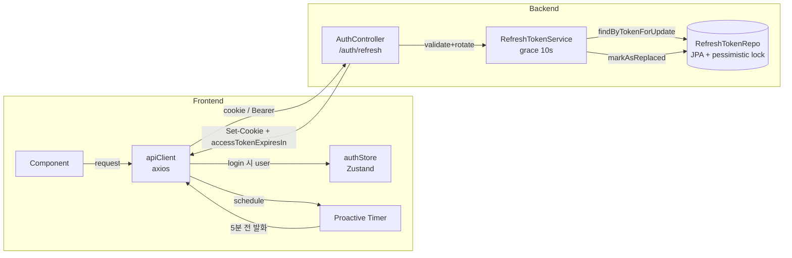
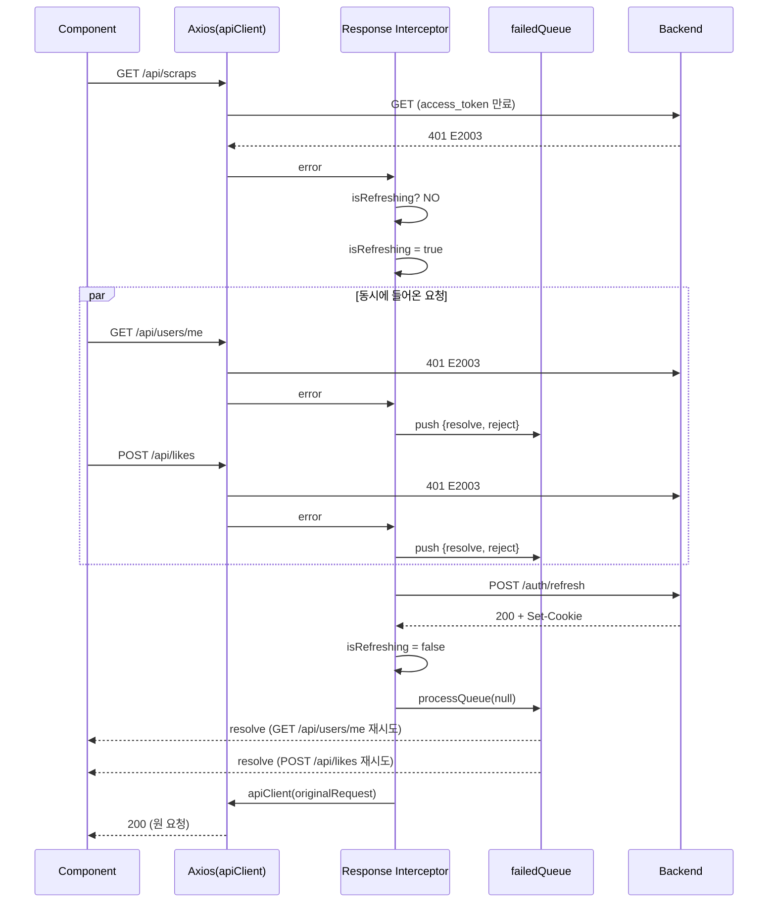
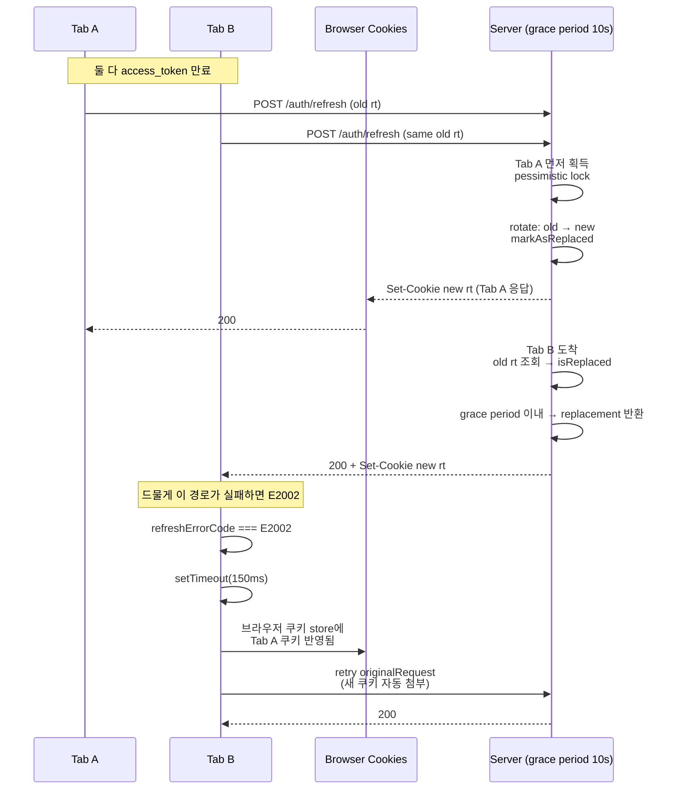
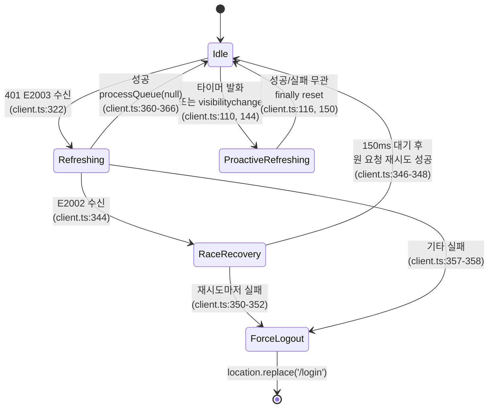
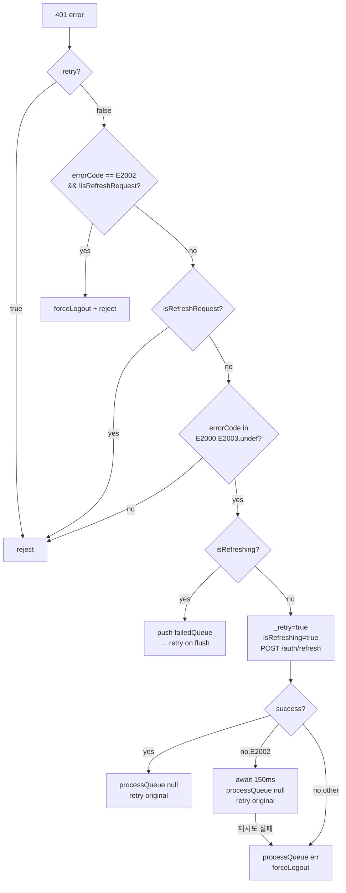

JWT 기반 인증은 처음 보면 단순합니다.

만료된 토큰으로 요청하면 서버가 `401`을 돌려주고, 클라이언트가 refresh token으로 새 access token을 받아 재시도하면 끝. 튜토리얼 한 편이면 충분해 보입니다.

그런데 실제로 프로덕션에 올려보면 얼마 지나지 않아 이상한 일들이 벌어지기 시작합니다.

- 사용자 한 명이 동시에 여러 API를 호출하면 refresh 요청이 **두세 개씩 동시에** 나갑니다
- 탭을 백그라운드에 오래 뒀다가 돌아오면 **타이머가 멈춰서** 이미 만료된 토큰으로 요청이 나갑니다
- 두 탭에서 같은 서비스를 쓰면 **refresh token이 엇갈려** 둘 중 한 탭이 뜬금없이 로그아웃됩니다
- refresh 요청 자체가 `401`을 받으면, 무심코 짠 인터셉터가 **영영 pending 상태에 갇혀버립니다**

이 글은 네 가지 문제를 PaintLater가 실제 코드에서 어떻게 풀었는지 하나씩 살펴보는 기록입니다. 결론부터 말하면 `BroadcastChannel`이나 Web Locks API 같은 크로스 탭 통신 API 없이도 멀티탭 문제를 실용적으로 해결할 수 있습니다. 비결은 **서버와 프론트가 역할을 잘 나누는 것** 입니다.

## 전체 그림

본론 전에 지도부터 펼쳐보겠습니다. PaintLater의 토큰 갱신은 프론트의 axios 인터셉터(`src/services/api/client.ts`, 총 383줄) 와 백엔드 `AuthController` / `RefreshTokenService` 가 한 짝이 되어 움직이는 구조입니다.



이 그림에서 두 가지만 먼저 기억하고 넘어가겠습니다.

첫째, **refresh token은 JPA(RDB)에 저장**됩니다. `RefreshTokenRepository.java`가 `JpaRepository`를 상속하고, `@Lock(PESSIMISTIC_WRITE)`로 비관적 락을 씁니다. 이 선택이 뒤에서 다룰 grace period와 맞물리는 포인트입니다.

둘째, **access token은 httpOnly 쿠키로 내려**옵니다. 그래서 프론트는 JWT의 `exp`를 JS로 읽을 방법이 없습니다. 대신 서버가 login/refresh 응답 바디에 `accessTokenExpiresIn`(남은 ms)을 함께 보내줍니다. 프론트는 이 값 하나로 타이머를 스케줄합니다.

이 두 제약이 앞으로 등장할 다섯 가지 패턴의 배경을 거의 다 설명해줍니다.

## 문제 1 — 동시 요청이 만드는 N개의 refresh

SPA는 한 화면에서 수십 개의 API를 병렬로 날립니다. 대시보드 하나 열면 `/projects`, `/miniatures`, `/calendar/events`, `/notifications/unread-count` 같은 요청들이 한꺼번에 나갑니다.

이 상태에서 access token이 만료되면 어떻게 될까요?



PaintLater는 두 변수만으로 이 문제를 해결합니다 (`client.ts:197, 199-202`).

```ts
let isRefreshing = false
let failedQueue: Array<{
  resolve: (value?: unknown) => void
  reject: (reason?: unknown) => void
}> = []
```

첫 번째 `401`을 받으면 `isRefreshing = true`로 잠금을 걸고 `/auth/refresh`를 호출합니다. 그 사이에 밀려들어오는 나머지 `401`들은 새 갱신 요청을 만드는 대신, `failedQueue`에 `{resolve, reject}` 한 쌍씩 넣고 기다립니다 (`client.ts:311-319`).

```ts
if (isRefreshing) {
  return new Promise((resolve, reject) => {
    failedQueue.push({ resolve, reject })
  })
    .then(() => apiClient(originalRequest))
    .catch((err) => Promise.reject(err))
}
```

여기서 한 가지 주목할 점이 있습니다. 큐에 저장되는 건 **요청 객체가 아니라 Promise의 resolve/reject 함수 자체**입니다. `.then(() => apiClient(originalRequest))` 체인 덕분에, 각 대기자는 자기만의 클로저 안에 원래 요청을 붙잡고 있다가 깨어나면 각자 재시도합니다. 큐가 재시도 로직을 품지 않고 "통과해도 된다"는 신호만 뿌리는 구조입니다. 요청 객체를 큐에 직접 저장하는 방식보다 간결합니다.

갱신이 성공하면 이렇게 마무리됩니다 (`client.ts:360-367`).

```ts
} finally {
  isRefreshing = false
}
// try 블록 바깥에서 flush
processQueue(null)
return apiClient(originalRequest)
```

`processQueue`는 큐를 순회하면서 대기자를 전부 `resolve()`만 시키고 배열을 비웁니다 (`client.ts:207-216`). 실제 재시도는 각자의 `.then` 체인이 알아서 처리합니다.

그리고 마지막에 숨어있는 반전 하나. `processQueue`와 `apiClient(originalRequest)` 호출은 `try` 블록 **바깥**에 있습니다. 주석이 이 의도를 직접 설명합니다 (`client.ts:364-365`).

```ts
// try 블록 바깥: 재시도가 500 등으로 실패해도 catch의 forceLogout이
// 트리거되지 않도록 함
```

갱신은 분명히 성공했는데 재시도가 네트워크 오류로 터질 수 있습니다. 이걸 로그아웃으로 처리하면 사용자 입장에선 억울한 상황이 됩니다. 그래서 일부러 `try`의 영향권 밖으로 빼놓았습니다.

## 문제 2 — 백그라운드 탭에서 타이머가 멈춘다

앞에서 본 게 "401을 받고 나서 움직이는" 반응형 갱신입니다. 이것만으로는 사용자 관점에서 최소 한 건의 요청이 "실패하고 재시도됐다"는 미묘한 지연을 체감하게 됩니다. 그래서 PaintLater는 **만료되기 5분 전에 미리** 갱신합니다 (`client.ts:58, 99-119`).

```ts
const PROACTIVE_REFRESH_BUFFER_MS = 5 * 60 * 1000

function scheduleProactiveRefresh(expiresInMs: number) {
  clearRefreshTimer()
  const delay = Math.max(expiresInMs - PROACTIVE_REFRESH_BUFFER_MS, 30_000)
  lastRefreshScheduledAt = Date.now()
  lastExpiresInMs = expiresInMs

  refreshTimerId = setTimeout(async () => {
    if (!useAuthStore.getState().isAuthenticated) return
    if (isRefreshing || isProactiveRefreshing) return
    try {
      isProactiveRefreshing = true
      await apiClient.post('/auth/refresh')
    } catch { /* 실패해도 다음 요청이 401로 처리함 */ }
    finally { isProactiveRefreshing = false }
  }, delay)
}
```

`Math.max(..., 30_000)`이라는 작은 방어 코드가 은근히 중요합니다. 개발 환경에서 토큰 만료를 3분 같은 짧은 값으로 설정해두면 `expiresInMs - 버퍼`가 음수가 됩니다. 그러면 `setTimeout`이 즉시 발화하면서 무한 루프에 가까운 갱신이 돌아버립니다. 최소 30초는 기다리도록 바닥을 깔아둔 것입니다.

이 함수는 login 응답과 refresh 응답이 올 때마다 호출됩니다. 서버가 매번 `accessTokenExpiresIn`을 내려주므로(`AuthController.java:555`), 프론트는 그때그때 새 만료 시각으로 타이머를 재스케줄합니다.

### 그런데 브라우저가 협조하지 않는다

`setTimeout`은 웹 표준입니다. 5분 뒤에 정확히 발화해 줄 거라고 기대하고 싶습니다. 그런데 크롬, 사파리, 파이어폭스 **모두** 백그라운드 탭의 타이머를 공격적으로 throttle합니다. 일부 케이스는 아예 멈춰버립니다.

사용자가 탭을 백그라운드에 두고 8분 뒤에 돌아온다고 해봅시다. 프로액티브 타이머는 발화하지 않았고, 다음 클릭은 만료된 토큰으로 요청을 내보냅니다. 피하려던 바로 그 경로로 돌아가는 겁니다.

PaintLater는 이 문제를 **`visibilitychange` 이벤트로 수동 보정**해서 해결합니다 (`client.ts:132-154`). 탭이 다시 보이는 순간, 경과 시간을 직접 계산해서 "이미 발화했어야 하는" 상황이면 그 자리에서 즉시 갱신을 트리거합니다.

```ts
document.addEventListener('visibilitychange', () => {
  if (document.visibilityState !== 'visible') return
  if (!useAuthStore.getState().isAuthenticated) return
  if (lastRefreshScheduledAt === 0) return

  const elapsed = Date.now() - lastRefreshScheduledAt
  const threshold = lastExpiresInMs - PROACTIVE_REFRESH_BUFFER_MS
  if (elapsed > threshold) {
    // 이미 프로액티브 타이머가 발화했어야 할 시점을 지남
    if (isRefreshing || isProactiveRefreshing) return
    ;(async () => {
      try {
        isProactiveRefreshing = true
        await apiClient.post('/auth/refresh')
      } catch { /* 무시 */ }
      finally { isProactiveRefreshing = false }
    })()
  }
})
```

여기서 `lastRefreshScheduledAt`과 `lastExpiresInMs`를 미리 저장해둔 설계가 효과를 발휘합니다 (`client.ts:89-91, 103-104`). 타이머 객체 자체를 검사하는 대신 "언제 스케줄했는지"와 "만료까지 얼마 남았었는지" 두 값만 기억해두면 경과 시간을 계산할 수 있습니다.

Web Worker나 Service Worker를 동원하면 백그라운드 throttle을 어느 정도 피할 수 있습니다. 그만큼 복잡도가 따라붙는 건 덤입니다. PaintLater는 그 길을 택하지 않았습니다. Visibility API 한 줄이 복잡한 워커 설정보다 실수할 여지가 적다는 판단이었습니다.

## 문제 3 — refresh 요청 자체가 401을 받으면?

여기서 초심자가 자주 빠지는 함정이 하나 있습니다. 다음 코드를 보겠습니다.

```ts
// 함정: 만약 /auth/refresh 요청 자체가 401이면 어떻게 될까?
if (status === 401 && !original._retry) {
  if (isRefreshing) {
    return new Promise((resolve, reject) => {
      failedQueue.push({ resolve, reject })
    }).then(() => apiClient(original))
  }
  original._retry = true
  isRefreshing = true
  await apiClient.post('/auth/refresh')
  ...
}
```

`/auth/refresh`가 만료된 refresh token을 가지고 호출되면 서버는 `401`을 돌려줍니다. 이 `401`이 다시 응답 인터셉터를 타고 들어오는데, 이 시점에 이미 `isRefreshing === true` 상태입니다. 그래서 refresh 요청이 **자기 자신을 `failedQueue`에 넣고 기다립니다**.

큐를 flush해 줄 `processQueue`는 이 refresh가 끝나야 호출되는데, 정작 refresh는 큐에서 깨워주기를 기다리고 있는 상태입니다. **영원한 상호 대기**가 성립합니다.

PaintLater는 URL 기반 가드 한 줄로 이 문제를 피합니다 (`client.ts:272, 300-302`).

```ts
const isRefreshRequest = /\/auth\/refresh$/.test(url)

// ...

if (isRefreshRequest) {
  // refresh 요청 자체가 401이면 큐에 넣지 않고 바깥 catch로 보낸다
  return Promise.reject(error)
}
```

원 요청이 refresh 엔드포인트면 큐잉 로직을 건너뛰고 즉시 reject합니다. 바깥의 `try`에 있는 `await apiClient.post('/auth/refresh')`가 이 reject를 받고, catch 블록이 `forceLogout()`으로 이어집니다.

### 그럼 axios 인스턴스를 두 개로 나누면 더 깔끔하지 않을까

흔히 쓰는 전통적 해법입니다. `authClient`와 `apiClient`를 따로 만들어서, `authClient`는 인터셉터 없이 사용하는 방식입니다. 그러면 `/auth/refresh` 호출은 인터셉터 체인을 아예 타지 않으니 큐잉 문제가 발생할 일이 없습니다.

그런데 PaintLater는 단일 인스턴스를 고집합니다. 이유는 코드로 어느 정도 추론할 수 있습니다.

`baseURL`, `timeout`, `withCredentials`, `Content-Type` 같은 기본값을 두 인스턴스에 중복으로 관리해야 하고, i18n 언어 헤더·뱃지 체크 이벤트·사일런트 URL 처리 같은 **mutating이 아닌 횡단 관심사**가 제법 많습니다. 이걸 전부 복제하는 건 유지보수 부담이 큽니다.

URL 정규식 한 줄(`/\/auth\/refresh$/`)이 그 모든 부담보다 가볍다고 판단한 것입니다. 트레이드오프는 명확합니다. **가드를 놓치면 즉시 데드락**이 납니다. 위험도는 높지만, 테스트로 잡을 수 있는 종류의 버그라 감수할 만합니다.

한 가지 더. 앞에서 프로액티브 갱신은 `isProactiveRefreshing`이라는 **별도 플래그**를 쓴다고 했습니다. 코드 주석에 이유가 박혀 있습니다 (`client.ts:92`).

```
선제적 갱신 전용 플래그 (반응적 갱신의 isRefreshing과 분리하여 큐 데드락 방지)
```

프로액티브 경로가 `isRefreshing`을 true로 바꾸는 순간 그 사이에 들어온 `401`들이 전부 큐에 쌓입니다. 그런데 프로액티브 갱신은 `processQueue`를 호출하지 않습니다. 성공하면 그냥 응답 인터셉터만 타고 끝납니다. 그래서 큐가 비워지지 않고 묶여버립니다. 두 경로의 플래그를 분리한 건 이 문제를 피하기 위한 의도적 선택입니다.

## 문제 4 — 멀티탭 경합, 그리고 150ms의 정체

지금까지는 **한 탭 안에서의 경합**이었습니다. 이제 탭이 두 개인 상황으로 넘어가보겠습니다.

사용자가 크롬에서 PaintLater를 두 탭으로 열어놓고 작업 중이라고 해봅시다. 같은 도메인이므로 두 탭은 httpOnly 쿠키를 공유합니다. 한 탭이 `Set-Cookie`를 받으면 다른 탭도 그 쿠키로 다음 요청을 보냅니다.

문제는 **두 탭이 동시에** 만료 시점에 걸렸을 때입니다.



### 서버 쪽 설계 — 10초 grace period

PaintLater 백엔드는 refresh token을 회전시킵니다. 매 갱신마다 새 토큰을 발급하고 옛 토큰은 폐기합니다. 여기까지는 일반적입니다. 그런데 폐기하는 방식이 조금 독특합니다 (`RefreshTokenService.java:107-126`).

옛 토큰을 **즉시 삭제하지 않고**, 대신 `replacedByToken = newToken`이라는 참조를 남겨둡니다. 그리고 옛 토큰을 조회하는 요청이 오면 이렇게 분기합니다 (`RefreshTokenService.java:79-99`).

1. 옛 토큰이 `isReplaced == true`이고
2. 교체 시점으로부터 **10초 이내**(`gracePeriodMs = 10_000`, `RefreshTokenService.java:34-35`)라면
3. 옛 토큰이 가리키는 `replacedByToken`을 찾아서 그 값을 새 응답으로 돌려준다

탭 B가 "옛" refresh token으로 요청해도 서버는 "옆 탭이 방금 갱신했다"는 사실을 기억했다가 같은 새 토큰을 내려줍니다. 정상 응답으로 간주되는 것입니다.

grace period를 10초로 길게 잡은 이유는 멀티탭 지원뿐만 아니라 **토큰 탈취 탐지** 목적도 있습니다. 11초가 넘은 후에 같은 옛 토큰이 또 오면 그땐 진짜 도둑으로 간주하고, 해당 유저의 모든 refresh token을 싹 삭제해 강제 로그아웃시킵니다 (`RefreshTokenService.java:82-86`). 이것이 일반적으로 말하는 **탐지형 토큰 로테이션** 패턴입니다.

### 왜 refresh token을 JPA에 저장했나

PaintLater 백엔드는 Redis도 쓰고 있습니다. 다만 **refresh token만큼은 JPA(RDB)에 넣기로** 했습니다. 이유는 세 가지입니다.

**1. 재시작해도 안 튕긴다.** PaintLater는 거의 매일 한 번씩 배포가 일어납니다. 토큰이 메모리 기반 저장소에 있으면 재시작 한 번에 전 유저가 로그아웃될 수 있습니다. RDB는 그냥 껐다 켜도 데이터가 남아 있으니 이 걱정이 없습니다.

**2. grace period가 트랜잭션으로 자연스럽다.** 10초 창문 로직은 "옛 토큰 찾기 → 교체 여부 확인 → 새 토큰 반환"이 한 덩어리로 일어나야 합니다. JPA에서는 `@Transactional` + `@Lock(PESSIMISTIC_WRITE)` 한 줄이면 끝나는 일입니다. Redis로 같은 걸 만들려면 Lua 스크립트를 따로 짜야 하는데, 이 정도 규모에서 감당할 복잡도는 아닙니다.

**3. 아직 Redis가 꼭 필요한 규모가 아니다.** 토큰 발급량이 RDB를 흔들 정도가 되거나 인스턴스를 여러 개로 늘릴 때가 오면 그때 옮기면 됩니다. 지금은 테이블 하나로 충분합니다.

"인증이니까 Redis"라는 공식 대신, **트랜잭션이 공짜로 얻어지고 재시작에도 안전한 쪽**을 고른 결정이었습니다.

### 그럼에도 E2002를 받을 때가 있다

서버의 grace period가 대부분의 경우를 커버합니다. 그러나 아주 드물게 실패하는 경로가 있습니다.

- 탭 A의 응답 처리가 늦어져 쿠키 반영이 지연되는 경우
- 탭 B가 쿠키를 읽기 직전에 브라우저 쿠키 스토어 캐시가 옛값을 반환하는 경우
- 서버의 비관적 락이 타임아웃되는 경우

이런 상황에서 탭 B는 `E2002`(INVALID_TOKEN)을 받습니다. 초기 구현이었다면 여기서 바로 `forceLogout`이었을 것입니다. 사용자 입장에서는 "왜 갑자기 로그아웃됐지?" 하고 당황할 수밖에 없습니다.

PaintLater는 이 상황을 **한 번의 휴리스틱 재시도**로 풀어냅니다 (`client.ts:344-354`).

```ts
if (refreshErrorCode === ERROR_CODES.INVALID_TOKEN) {
  try {
    await new Promise((resolve) => setTimeout(resolve, 150))
    processQueue(null)
    return await apiClient(originalRequest)
  } catch (raceRecoveryError) {
    processQueue(raceRecoveryError as Error)
    forceLogout()
    return Promise.reject(raceRecoveryError)
  }
}
```

150ms를 기다리는 동안 다음 일이 일어납니다.

1. 탭 A의 `Set-Cookie` 응답이 **이 탭의 브라우저 쿠키 스토어에 반영**된다
2. `processQueue(null)`이 대기 중인 요청들을 깨운다
3. 원 요청 하나를 재시도한다. 이번엔 탭 A가 쓴 새 쿠키가 자동으로 첨부된다

재시도가 성공하면 사용자는 아무 일도 없었던 것처럼 그대로 작업을 이어갑니다. 재시도마저 실패하면 그때 확정 로그아웃으로 넘어갑니다.

### 150ms, 어디서 나온 숫자인가

일반적인 브라우저의 쿠키 업데이트는 수 밀리초 안에 끝나지만, 다음을 감안한 여유값이 포함되어 있습니다.

- Set-Cookie 네트워크 왕복 지연 (10~50ms)
- HTTP/2 스트림 멀티플렉싱 지연
- 브라우저 메인 스레드가 바쁠 때의 추가 지연

너무 짧으면 정작 쿠키가 반영되기 전에 재시도해서 또 실패하고, 너무 길면 사용자가 체감 지연을 느낍니다. 150ms는 **사용자가 "느려졌다"고 느끼지 않는 상한선** 근처입니다.

### 그럼 BroadcastChannel을 써야 하는 것 아닌가

교과서적인 답은 `BroadcastChannel('auth')` 같은 크로스 탭 통신 API를 쓰는 것입니다. 한 탭이 갱신에 성공하면 다른 탭들에게 "나 했으니 너는 호출하지 마"라고 알리고, 메시지를 받은 탭은 refresh 호출을 skip하는 방식입니다.

그런데 PaintLater는 **의도적으로 이 메커니즘을 쓰지 않습니다**. `miniature-backlog-web/src` 전체를 `BroadcastChannel`, `navigator.locks`, `addEventListener('storage')`로 grep해봐도 매칭이 하나도 없습니다. `Visibility API`만 쓰는데, 그마저도 크로스 탭 동기화 목적이 아니라 앞에서 본 타이머 보정용입니다.

이유는 명확합니다. **서버가 이미 grace period로 복구 로직을 제공하고 있기 때문**입니다. 프론트가 추가로 크로스 탭 동기화를 구현해봐야 중복 보호망이 될 뿐입니다. 얻는 건 네트워크 호출 한두 개 아끼는 정도, 잃는 건 코드 복잡도와 새 의존성입니다. 남는 장사가 아닙니다.

설계 관점에서 보면 이 조합은 **책임 분담의 좋은 예**입니다.

- 서버: 교체된 옛 토큰을 10초 동안 기억했다가 재사용을 허용한다
- 프론트: 아주 드문 실패 경로에서 150ms 대기 후 딱 한 번만 재시도한다

둘 중 하나만 있어도 대부분의 경우는 돌아갑니다. 둘 다 있으면 거의 모든 경우에 사용자는 아무것도 모릅니다.

## 전체 상태 머신

지금까지 등장한 플래그와 전이를 한 장의 그림에 모았습니다.



다섯 개의 상태 중 `RaceRecovery`만이 이 글의 진짜 주인공입니다. 나머지는 전부 예비 장치입니다.

상태를 구성하는 플래그는 네 개입니다.

- `isRefreshing` — 반응적 갱신 중
- `isProactiveRefreshing` — 선제적 갱신 중 (반응적과 분리, 데드락 방지)
- `isForceLoggingOut` — 로그아웃 처리 중 (중복 호출 방지)
- `originalRequest._retry` — 이 요청은 이미 한 번 재시도됨

각각이 커버하는 레이스가 다릅니다. "플래그 하나로 통합하면 깔끔하지 않을까" 하고 손대는 순간 **거의 확실히 미묘한 버그가 돌아옵니다**.

## 401 분기 전체 플로우

참고용으로 401 에러가 도착했을 때의 전체 분기 트리를 붙여둡니다.



각 분기가 실제 경합 시나리오 하나씩을 막고 있습니다. `client.ts:266-368`의 본문과 1:1로 대응합니다.

## 직접 구현할 때의 체크리스트

이 패턴을 자기 프로젝트에 적용할 때 놓치기 쉬운 것들입니다.

- [ ] **응답 인터셉터에서 URL 가드**로 `/auth/refresh` 요청을 큐잉 로직에서 제외
- [ ] **반응적 갱신 플래그와 프로액티브 플래그를 분리** (큐 데드락 방지)
- [ ] `originalRequest._retry` 마킹으로 **무한 재시도 방지**
- [ ] `processQueue`와 재시도는 `try` 블록 **바깥**에 두어, 재시도 실패가 catch로 흘러가지 않도록
- [ ] 프로액티브 타이머에 `Math.max(delay, 최소값)` 방어 (짧은 만료 대응)
- [ ] `visibilitychange` 이벤트로 백그라운드 throttle 보정
- [ ] `forceLogout`에 **중복 호출 가드 플래그**
- [ ] 서버 측 refresh token 회전 + **grace period 10초 내외** 구현
- [ ] 멀티탭 경합 복구는 `BroadcastChannel` 대신 **150ms 대기 + 1회 재시도**를 먼저 시도 (복잡도 대비 이득이 크다)
- [ ] refresh 쿠키는 `Path=/auth/refresh`로 한정해 **공격면 축소**
- [ ] 에러 코드를 프론트와 백이 **명확한 계약으로** 공유 (E2002 = 로그아웃 / E2003 = 갱신)

## 언제 Web Locks API로 넘어가야 하는가

150ms 휴리스틱이 만능은 아닙니다. 다음 상황에서는 명시적 크로스 탭 동기화로 넘어가는 것을 고려할 만합니다.

- **세 개 이상의 탭이 동시에** 만료에 걸리는 일이 일상다반사인 환경 (예: 상담원 대시보드를 10개 탭으로 운영)
- **refresh token 발급 비용이 큰** 경우 (외부 IdP 호출을 포함하는 등)
- **오프라인 → 온라인 전환**이 잦아 모든 탭이 한꺼번에 재연결되는 환경 (PWA 등)

이런 경우에는 `navigator.locks.request('auth-refresh', ...)` 로 탭 간 뮤텍스를 잡거나, `SharedWorker`에 단일 토큰 서비스를 두는 쪽이 안정적입니다. 그런데 **평범한 SPA의 90%는 여기까지 갈 일이 없습니다**. 서버가 grace period만 제대로 구현하면 프론트는 150ms 재시도만으로 충분합니다.

## 마치며

아래는 이 구현에서 **"쓰지 않은 것"** 의 목록입니다.

- Web Locks API ❌
- BroadcastChannel ❌
- Storage 이벤트 리스너 ❌
- Service Worker 기반 토큰 조정 ❌
- SharedWorker ❌
- axios 인스턴스 분리 ❌

대신 실제 구현한 내용은 다음과 같습니다.

- `setTimeout` 한 번
- `document.addEventListener('visibilitychange', ...)` 한 번
- 정규식 한 줄 (`/\/auth\/refresh$/`)
- 플래그 네 개와 배열 하나
- 서버의 10초 grace period
- 숫자 `150`

조합의 순서와 역할 분담만으 복잡한 문제의 단순한 해법을 도출해냈습니다.
결국 해답은 **도구를 많이 쓰는 것이 아니라 책임을 잘 나누는 것**에서 나온다고 생각됩니다.
