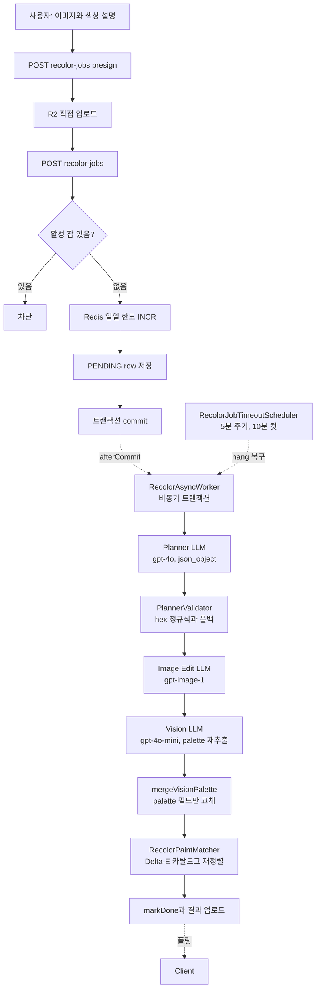
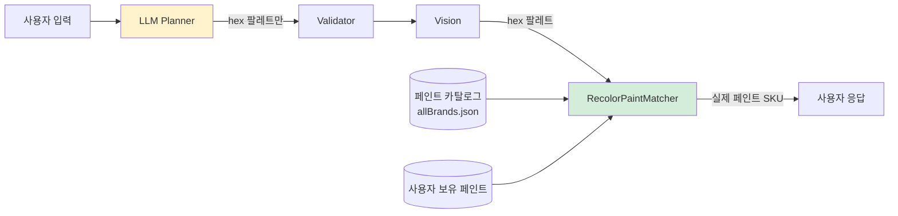

AI로 뭔가를 추천하는 기능을 만들다 보면 비슷한 순간이 꼭 한 번은 찾아옵니다. 데모는 멋지게 돌아가는데, 실제로 사용자가 이상한 입력을 넣기 시작하면 모델이 갑자기 **존재하지 않는 페인트 이름**을 만들어 내거나, **여덟 자리 hex**를 뱉거나, `"#GGGGGG"` 같은 유사-hex 문자열을 돌려줍니다. 프롬프트를 아무리 조여도, 언젠가는 한 번씩 깨집니다.

PaintLater의 "AI 도색" 기능(코드베이스 내부 명칭은 *Recolor*)은 사용자가 올린 미니어처 사진에 원하는 색상 설명(예: "붉은 망토에 금색 트림")을 붙이면 AI가 **채색된 결과 이미지 + 실제 구매 가능한 페인트 추천 트라이어드**를 돌려주는 기능입니다. 이 기능을 만들면서 우리는 **"LLM의 출력은 답이 아니라 검증되어야 할 입력"**이라는 전제로 파이프라인 전체를 설계했습니다. 이 글은 그 설계의 각 방어선이 **어떤 실패 유형을 어떻게 막는가**를 실제 코드에서 읽어내는 기록입니다.

## 전체 그림

AI 도색 파이프라인의 대략적인 흐름은 다음과 같습니다.



전체 흐름을 정리하면 이렇습니다. LLM은 "색 방향"을 제안하기만 하고, "실제 페인트"는 결정론적 Java 엔진이 고릅니다. 이 글은 이 역할 분리가 각 단계에서 어떻게 구현돼 있는지를 따라갑니다.

저장소 좌표:

- 컨트롤러: `recolor/controller/RecolorJobController.java` — `/recolor-jobs` 7개 엔드포인트
- 오케스트레이션: `recolor/service/RecolorJobService.java` (동기), `RecolorAsyncWorker.java` (비동기)
- LLM 호출: `recolor/service/RecolorPlannerClient.java` — Planner / Vision 두 종
- 검증: `recolor/service/PlannerValidator.java`
- 매칭: `recolor/service/RecolorPaintMatcher.java`
- 안전망: `recolor/service/RecolorJobTimeoutScheduler.java`

## AI가 잘하는 것과 못하는 것

파이프라인이 왜 이렇게 여러 단계로 쪼개져 있는지 이해하려면, 먼저 **AI가 잘하는 일과 못하는 일을 서로 다른 상자에 넣는 연습**이 필요합니다. 이 프로젝트에서 LLM을 붙여보기 전까지는 저도 머릿속에서 이 구분이 흐릿했는데, 실제로 각 단계를 만들어 보니 두 상자는 생각보다 뚜렷하게 갈라졌습니다.

### LLM이 잘하는 것

- **자연어 색상 의도를 색 공간에 매핑한다.** "녹슨 강철 느낌의 갑옷"이라고 쓰면 모델은 `#5A4535` 같은 탁한 갈색 톤을 그럴듯하게 집어냅니다. 사람이 쓰는 모호한 색 표현을 6자리 hex로 옮기는 일은 — 검증만 붙이면 — LLM이 가장 빛나는 작업입니다.
- **이미지를 실제로 채색한다.** OpenAI Image Edit(`gpt-image-1`) 같은 모델은 미니어처 원본 사진을 받아 "이 팔레트로 도색하면 이렇게 보인다"를 **이미지로** 돌려줍니다. 프리뷰용으로 사람이 직접 모델링 툴에서 리텍스처를 입히는 것과 비교할 때, 속도와 퀄리티 모두 압도적으로 유리합니다. 이건 전통적인 결정론적 코드가 할 수 있는 일이 아닙니다.
- **생성된 이미지에서 색을 다시 추출한다.** Vision 모델(`gpt-4o-mini`)에게 결과 이미지를 주고 "실제로 어떤 색이 쓰였는지" 다시 물어보면, Planner 단계가 의도한 색과 Image Edit 단계가 실제로 그린 색 사이의 드리프트를 잡아낼 수 있습니다. 이 "생성 → 재확인" 루프는 LLM 없이는 불가능한 피드백입니다.
- **부가 색상을 제안한다.** 추출된 색이 5개 미만이면 Vision 프롬프트가 "보색 / 유사색 / 분할보색 이론으로 2~3개의 포인트 색을 추천하라"고 지시합니다. 색 이론 기반의 창의적 제안은 규칙 기반 코드로 재현하기 어려운 영역입니다.

### LLM이 못하는 것 (혹은 하면 안 되는 것)

- **실재하는 페인트 SKU를 정확히 안다.** 이건 환각이 거의 필연입니다. "시타델 크림슨 플레임"이 있냐고 물으면 모델은 자신 있게 "네, 2023년에 출시된 레이어 페인트입니다"라고 답할 수 있고, 그 답은 정교하게 틀립니다. 카탈로그 진실은 `allBrands.json`에 있고, 그 파일만이 유일한 진리원입니다.
- **사용자 보유 페인트와 비교한다.** 사용자가 어떤 페인트를 이미 들고 있는지는 DB에 있는 정보이고, 이걸 LLM 프롬프트에 넣으면 토큰이 폭발합니다. 그리고 설령 넣는다 해도 LLM은 "보유 페인트 중 ΔE가 가장 작은 것"을 확실히 찾는 도구가 아닙니다. 이건 결정론적으로 풀어야 하는 문제입니다.
- **지각적 색 거리를 계산한다.** CIEDE2000 같은 수식은 재현 가능해야 합니다. 같은 입력에 대해 항상 같은 숫자가 나와야 하고, 논문 테스트셋으로 회귀 검증이 가능해야 합니다. LLM의 "이 두 색이 얼마나 가까운가"는 프롬프트에 따라 흔들리는 추정치일 뿐입니다.
- **트라이어드의 휘도 다양성을 보장한다.** "shadow / midtone / highlight가 시각적으로 구분되어야 한다"는 제약은 LLM에게 설명할 수는 있지만, 매번 지킨다는 보장은 없습니다. `MIN_LUMINANCE_DIFF = 0.02`처럼 수치로 박아두고 코드가 강제하는 게 훨씬 싸고 확실합니다.
- **브랜드 정책/재고/가격을 반영한다.** "varnish는 추천하지 말라", "standard 타입만 허용한다" 같은 비즈니스 규칙은 프롬프트로 넣어도 통계적으로만 지켜집니다. 카탈로그 검색 단계에서 타입 화이트리스트로 거르는 게 100% 보장되는 유일한 방법입니다.

이 두 리스트를 양쪽에 두고 파이프라인을 다시 보면, 각 단계가 어느 쪽 상자에 들어가는지 한눈에 보입니다.

| 단계 | 누가 하는가 | 어느 상자인가 |
|---|---|---|
| 자연어 색상 설명 → hex 팔레트 | LLM Planner | 잘하는 것 |
| 이미지를 실제 팔레트로 채색 | LLM Image Edit | 잘하는 것 |
| 생성 결과에서 실제 색 재추출 | LLM Vision | 잘하는 것 |
| hex 형식 검증 / 폴백 | Java Validator | 못하는 것(결정론 필요) |
| 타입 화이트리스트 필터 | Java Matcher | 못하는 것(규칙 보장) |
| 카탈로그 페인트 ΔE 매칭 | Java Matcher | 못하는 것(수학) |
| 보유 페인트 우선 로직 | Java Matcher | 못하는 것(DB + 결정론) |
| 트라이어드 휘도 분리 | Java Matcher | 못하는 것(수치 규칙) |
| 혼합 레시피 생성 | Java Matcher | 못하는 것(규칙 + 보유 DB) |

결국 파이프라인의 구조는 하나의 설계 원칙에서 나옵니다. **"잘하는 것"은 LLM에게, "못하는 것"은 전통적 코드에.** 이 원칙이 다음 섹션부터 설명할 방어선들의 모양을 전부 결정합니다.

## 배경 지식 — Delta-E와 "지각적 색 거리"

본론에 들어가기 전에 하나만 짚고 갑니다. 이 글 전반에서 "카탈로그에서 가장 가까운 페인트를 고른다"는 말이 계속 등장하는데, 여기서 "가깝다"는 **단순한 RGB 유클리드 거리가 아닙니다**.

사람의 눈은 색 공간을 균등하게 느끼지 않습니다. `#0000FF`와 `#0033FF`는 수치상 거리가 큰데 눈에는 거의 같은 파랑으로 보이고, 반대로 미묘한 회색 차이는 수치가 작아도 선명하게 구분됩니다. 이 비균등성을 보정하기 위해 **CIE**는 여러 세대의 색 거리 공식을 내놨고, 그중 현재 표준이 **CIEDE2000 (ΔE00)**입니다.

PaintLater는 `common/util/ColorDistanceUtil.java`에 Sharma 2005 논문의 CIEDE2000을 그대로 구현해 두었고 (`:38~113`), **논문의 표준 검증셋 34쌍을 1e-4 허용 오차로 통과**하는 단위 테스트(`PaintConversionServiceCiede2000Test.java`)로 정확성을 회귀 검증합니다.

```java
// common/util/ColorDistanceUtil.java:108-112
double dL = dLp / SL;
double dC = dCp / SC;
double dH = dHp / SH;

return Math.sqrt(dL * dL + dC * dC + dH * dH + RT * dC * dH);
```

이 `deltaE(hex1, hex2)` 함수가 반환하는 숫자가, 아래에서 쓰이는 거의 모든 비즈니스 룰의 "거리"입니다. 몇 가지 임계값이 코드 전역에 박혀 있습니다.

| 상수 | 값 | 위치 | 용도 |
|---|---|---|---|
| `MAX_DELTA_E_THRESHOLD` | 10.0 | `PaintConversionService.java:33` | 페인트 변환에서 유사색 컷 |
| `OWNED_PREFER_THRESHOLD` | 5.0 | `RecolorPaintMatcher.java:32` | "ΔE 5 이내면 보유 페인트 우선" |
| `WIDE_DELTA_E` | 25.0 | `RecolorPaintMatcher.java:34` | 트라이어드 후보 검색 폭 |
| `match_type` 경계 | ΔE < 5.0 | `RecolorPaintMatcher.java:171` | `direct` vs `catalog` 라벨 |

ΔE 5 근방은 일반적으로 "구분되지만 비슷하다"고 인식되는 정도입니다. 이 숫자 하나가 "보유 페인트를 우선할지, 수학적으로 가장 가까운 새 페인트를 추천할지"를 가르는 스위치로 쓰입니다.

AI와는 별개로, 이런 결정론적 수치 기반 레이어는 백엔드에만 존재합니다. 프론트엔드에는 CIEDE2000 구현이 없고, 서버가 계산해 준 `deltaE` 값을 표시만 합니다. 덕분에 카탈로그가 바뀌어도 클라이언트를 건드릴 필요가 없습니다. 진리원이 한 곳에 모여 있을 때 얻는 이점입니다.

## 방어선 1 — LLM의 출력 도메인을 좁혀라

가장 중요한 설계 결정부터 시작합니다. `RecolorPlannerClient.java:91-122`의 system prompt에 이런 문장이 있습니다.

```
Do NOT recommend specific paints. Only provide hex colors and areas.
Paint matching is handled separately.
```

이 두 줄이 파이프라인 전체의 방향을 결정합니다.

LLM에게 "이 미니어처에 어울리는 시타델 페인트를 추천해줘"라고 바로 물어보는 접근은 의도적으로 피했습니다. 이유는 다음과 같습니다.

1. LLM은 존재하지 않는 페인트 이름을 자신 있게 지어냅니다 (예: "시타델 크림슨 플레임 — 환상의 신상품").
2. 페인트 카탈로그가 갱신되면 그 시점부터 LLM의 지식은 뒤쳐집니다.
3. 보유 페인트 정보를 프롬프트에 넣으면 토큰이 폭발하고, 프롬프트 인젝션 표면이 넓어집니다.
4. "이 색에 가장 가까운 페인트" 판단은 본질적으로 수학 문제인데, LLM은 결정론적이지 않습니다.

그래서 우리는 LLM의 책임을 **"사용자의 색상 의도 → hex 팔레트"로 좁혔습니다**. 사용자가 "붉은 망토에 금색 트림"이라고 쓰면 LLM은 `{"hex":"#8B1A1A","area":"cloak"}`, `{"hex":"#C9A227","area":"trim"}` 같은 **hex만** 돌려줍니다. 실제로 어떤 페인트가 이 hex에 가장 가까운지는 `RecolorPaintMatcher`가 나중에 Delta-E로 결정합니다.



이 분리 덕분에 LLM이 만들어낸 페인트 이름은 사용자 화면까지 넘어가지 않습니다. "가장 가까운 카탈로그 페인트" 판정은 언제나 `paintConversionService.matchByHex(...)`가 내리고, 이 함수는 실제로 존재하는 페인트 엔트리만 반환합니다.

## 방어선 2 — PlannerValidator: 거부하지 않고 흡수하는 검증기

LLM이 JSON으로 답을 주기로 했다고 해서 올바른 JSON이 온다는 보장은 없습니다. OpenAI `response_format: {"type":"json_object"}`로 1차 방어를 하지만, 여전히 여러 가지가 틀어질 수 있습니다.

- `palette` 필드 자체가 누락
- palette 항목의 `hex`가 5자리, 7자리, 또는 `"gold"` 같은 문자열
- palette가 배열이 아니라 구 형식의 객체
- 응답 전체가 JSON이 아님 (드물지만 발생)

`PlannerValidator.java:34-62`의 `validateAndFix`는 이 모든 경우를 처리하는데, 처리 방식이 재미있습니다. **예외를 던지지 않습니다.** 대신 문제를 조용히 흡수합니다.

```java
// PlannerValidator.java:34-62 (발췌)
public String validateAndFix(String plannerJson) {
    try {
        JsonNode root = objectMapper.readTree(plannerJson);
        if (!root.isObject()) {
            log.warn("Planner 응답이 JSON 객체가 아님, 폴백 사용");
            return buildFallbackJson();
        }

        ObjectNode obj = (ObjectNode) root;
        JsonNode palette = obj.get("palette");
        if (palette == null) {
            log.warn("palette 누락, 폴백 팔레트 사용");
            obj.set("palette", objectMapper.readTree(DEFAULT_PALETTE));
            return objectMapper.writeValueAsString(obj);
        }
        if (palette.isArray()) {
            validatePaletteArray((ArrayNode) palette);
        } else if (palette.isObject()) {
            validatePaletteHex((ObjectNode) palette);
        } else {
            log.warn("palette 형식 비정상, 폴백 팔레트 사용");
            obj.set("palette", objectMapper.readTree(DEFAULT_PALETTE));
        }
        return objectMapper.writeValueAsString(obj);
    } catch (Exception e) {
        log.error("Planner 검증 실패, 폴백 사용: {}", e.getMessage());
        return buildFallbackJson();
    }
}
```

validatePaletteArray는 잘못된 hex를 가진 항목을 **배열에서 제거**하고 (`:178-187`), validatePaletteHex는 잘못된 값을 `#808080`으로 **자동 보정**합니다 (`:189-198`). 최후의 수단인 `buildFallbackJson`은 grayscale 3색 팔레트를 돌려줍니다.

```java
// PlannerValidator.java:221-227
private static final String DEFAULT_PALETTE = """
        [
          { "hex": "#808080", "area": "main body" },
          { "hex": "#1B1B1B", "area": "secondary surfaces" },
          { "hex": "#9E9E9E", "area": "metallic parts" }
        ]
        """;
```

이 lenient 정책의 장점은, 사용자가 어떤 경우에도 결과를 받는다는 점입니다. LLM이 형편없는 응답을 했다고 해서 잡이 FAILED가 되지 않고, 폴백 팔레트로 파이프라인이 계속 흐릅니다.

대신 사일런트 품질 저하라는 트레이드오프가 따라옵니다. 잡은 DONE으로 끝나지만 사용자가 받은 추천이 회색 3색일 수도 있습니다. 다만 응답에 `confidence` 필드와 `warnings` 배열이 같이 담겨 있어서, UI가 이 값으로 "AI가 확신하지 못한 결과" 신호를 사용자에게 전달할 여지는 열려 있습니다.

## 방어선 3 — 카탈로그 타입 화이트리스트

LLM이 페인트를 추천하지 않도록 프롬프트로 묶었지만, **그 다음 단계인 Java 매처**도 똑같이 방어합니다. 이중 필터입니다.

```java
// RecolorPaintMatcher.java:28-30
private static final Set<String> RECOLOR_ALLOWED_TYPES =
    Set.of("standard");
private static final Set<String> GLOBALLY_EXCLUDED_TYPES =
    Set.of("medium", "varnish", "primer", "spray");
```

이 두 집합이 `paintConversionService.matchByHex(hex, 50, ALLOWED, EXCLUDED, 25.0)`로 전달되어 (`RecolorPaintMatcher.java:101-102`) **카탈로그 검색 단계 자체에서** 비-도료를 걸러냅니다.

이중 방어를 두는 이유는 프롬프트가 통계적이고 매처가 결정론적이기 때문입니다. 프롬프트로 "varnish를 언급하지 마라"라고 해도 모델이 한 번씩 이를 어기는 경우가 있고, LLM이 hex만 뱉더라도 그 hex가 우연히 어떤 varnish 제품의 색과 일치할 수 있습니다. Java 매처가 카탈로그 수준에서 `type != "standard"`를 거르고 나면, varnish 계열이 추천 후보에 올라올 여지 자체가 사라집니다.

## 방어선 4 — Delta-E 트라이어드 매칭 (LLM의 hex는 "검색 키"일 뿐)

이제 핵심 방어선입니다. Vision 단계가 생성된 이미지에서 실제로 쓰인 색을 재추출하고(`RecolorPlannerClient.analyzeResultImage`, `:142-181`), `PlannerValidator.mergeVisionPalette`가 원본 planner JSON의 `palette` **필드 하나만** 교체합니다 (`:74-99`). 그 뒤 이 팔레트가 `RecolorPaintMatcher`로 넘어갑니다.

매처는 각 hex에 대해 다음을 수행합니다.

1. **넓게 검색**: `matchByHex(hex, CATALOG_MATCH_MAX=50, …, WIDE_DELTA_E=25.0)`. ΔE 25는 지각적으로 꽤 먼 거리인데, 이렇게 넓게 잡는 이유는 다음 단계에서 "더 어두운 후보"와 "더 밝은 후보"를 둘 다 뽑아야 하기 때문입니다.
2. **anchor 선택**: `pickBest`가 ΔE 최소 후보를 고르되, **ΔE ≤ 5.0이면 보유 페인트를 우선** (`RecolorPaintMatcher.java:213-227`).
3. **휘도로 분리**: anchor의 luminance 기준으로 후보들을 darker/lighter 그룹으로 나눔 (`filterByLuminance`, `:184-194`).
4. **트라이어드 구성**: shadow(어두움) / midtone(anchor) / highlight(밝음) 세 슬롯을 채움. 한쪽이 부족하면 anchor를 끝으로 밀고 반대쪽에서 두 슬롯을 채우는 "시프트" 로직 (`:127-168`).
5. **라벨 결정**: midtone의 ΔE < 5.0이면 `match_type = "direct"` (정확히 일치), 아니면 `"catalog"` (근사) (`:171`).

```java
// RecolorPaintMatcher.java:213-227
private CatalogMatch pickBest(List<CatalogMatch> group, Set<Long> userCatalogPaintIds) {
    if (group == null || group.isEmpty()) return null;
    CatalogMatch best = group.get(0); // ΔE 최소 (이미 정렬됨)
    if (!userCatalogPaintIds.contains(best.paintId())) {
        for (CatalogMatch m : group) {
            if (userCatalogPaintIds.contains(m.paintId())
                    && m.deltaE() <= OWNED_PREFER_THRESHOLD) {
                return m;
            }
        }
    }
    return best;
}
```

이 한 함수가 매처의 우선순위 규칙을 요약합니다. "수학적으로 가장 가까운 페인트"와 "사용자가 이미 들고 있는 페인트"가 다를 때, ΔE 5 안에서는 보유 페인트를 먼저 고릅니다. 5를 넘어서면 정확도 쪽을 우선합니다.

그리고 매처의 출력이 `buildCandidateNode`(`:232-246`)를 거치고 나면, 사용자 응답에 실리는 hex/brand/name은 모두 카탈로그에 실재하는 페인트의 값으로 채워집니다. LLM이 뱉은 hex는 이 단계에서 "검색 키"로만 쓰이고 그대로 버려집니다.

## 방어선 5 — 혼합 레시피 폴백

카탈로그에 정확한 shadow/highlight가 없을 때를 대비해 한 겹 더 있습니다. `buildMixRecipes` (`RecolorPaintMatcher.java:253-298`)는 **사용자가 이미 가지고 있는 페인트들로 shadow/highlight를 직접 섞어 만드는 레시피**를 추가로 생성합니다.

```java
// RecolorPaintMatcher.java:287-294 (요약)
if (darkestOwned != null && hexToLuminance(darkestOwned.hex()) < 0.1) {
    recipes.add(buildMixRecipeNode("shadow", midtone, darkestOwned, 0.7, 0.3));
}
if (lightestOwned != null && hexToLuminance(lightestOwned.hex()) > 0.8) {
    recipes.add(buildMixRecipeNode("highlight", midtone, lightestOwned, 0.7, 0.3));
}
```

0.7 : 0.3 비율과 0.1 / 0.8 휘도 임계값은 하드코딩돼 있고, 어떻게 도출됐는지 코드에는 근거가 없습니다 (정직하게 쓰자면, 경험적 추정일 가능성이 높습니다). 이 레시피는 **카탈로그 트라이어드를 대체하지 않고** 별도의 `mix_recipes` 필드로 나란히 노출되어, 사용자가 "카탈로그 추천 중 마음에 드는 게 없으면 직접 섞을 수 있는 옵션"을 갖게 합니다.

## 방어선 6 — `afterCommit` 비동기 디스패치

이제 위의 모든 단계를 **언제 실행할 것인가**의 문제입니다. 단순한 답은 `@Async`를 거는 것인데, 그것만으로는 안 됩니다.

`RecolorJobService.createJob`은 잡을 DB에 저장한 뒤 `RecolorAsyncWorker.execute(jobId)`를 호출해야 합니다. 그런데 `@Async` 메서드가 호출되는 시점이 **부모 트랜잭션 커밋 전**이면 두 가지가 깨집니다.

1. 워커 스레드가 별도 트랜잭션으로 `findById(jobId)`를 하면 **아직 커밋되지 않은 row가 보이지 않습니다** (READ_COMMITTED 격리).
2. 부모 트랜잭션이 어떤 이유로 롤백되면 **존재하지 않는 잡을 워커가 처리**하게 됩니다 — 그리고 OpenAI 호출 비용이 실제로 발생합니다.

해법은 `TransactionSynchronizationManager.registerSynchronization`으로 `afterCommit` 훅에 디스패치를 묶는 것입니다.

```java
// RecolorJobService.java:122-129
// 비동기 파이프라인은 트랜잭션 커밋 후 실행 (레이스 컨디션 방지)
TransactionSynchronizationManager.registerSynchronization(new TransactionSynchronization() {
    @Override
    public void afterCommit() {
        recolorAsyncWorker.execute(jobId);
    }
});
```

이렇게 하면 DB에 커밋된 잡만 워커가 본다는 불변식을 유지할 수 있습니다. 부모 트랜잭션이 롤백되면 `afterCommit`이 호출되지 않으므로, 비싼 OpenAI 호출 비용도 발생하지 않습니다.

워커 진입부에는 한 겹 더 있습니다.

```java
// RecolorJobRepository.java:32-34
@Modifying
@Query("UPDATE RecolorJob j SET j.status = 'RUNNING' WHERE j.id = :id AND j.status = 'PENDING'")
int markRunningIfPending(@Param("id") Long id);
```

조건부 UPDATE입니다. 반환값이 0이면 이미 다른 워커가 처리 중이거나 완료된 상태이므로 즉시 리턴합니다. 이 방식으로 워커 수준의 멱등성을 확보합니다. timeout scheduler가 hang된 잡을 재처리할 때 같은 잡이 두 번 실행되지 않도록 잡아주는 안전장치입니다.

## 방어선 7 — 타임아웃 스케줄러 (안전망의 안전망)

OpenAI API가 hang되는 건 드물지만 발생합니다. `RecolorPlannerClient`의 `RestClient`는 `readTimeout = 60s`(`:40`)로 1차 방어를 하지만, 더 이상한 경우 — JVM 강제 종료, 서버 재시작 중 비동기 작업 유실, hang이 read timeout을 우회 — 에 대비해 5분 주기 스케줄러가 돌고 있습니다.

```java
// RecolorJobTimeoutScheduler.java:25-58 (요약)
private static final int TIMEOUT_MINUTES = 10;

@Scheduled(fixedRate = 300_000)
public void sweepStuckJobs() {
    LocalDateTime cutoff = LocalDateTime.now().minusMinutes(TIMEOUT_MINUTES);
    List<RecolorJob> stuck = recolorJobRepository.findStuckJobs(cutoff);
    for (RecolorJob job : stuck) {
        job.markFailed(RECOLOR_JOB_TIMEOUT.code, ..., plannerJson, recommendationJson);
        dailyUsageLimiter.rollback("recolor", job.getUserId());
    }
    recolorJobRepository.saveAll(stuck);
}
```

코드 주석이 이 스케줄러의 자기 인식을 정확히 표현합니다.

> HTTP 타임아웃(RestClient)이 주 방어선이며, 이 스케줄러는 서버 재시작 등 예외 상황에 대비한 안전망 역할.

`updated_at`이 10분 이상 경과한 PENDING/RUNNING 잡을 찾아 FAILED로 전이시키고, **Redis 일일 한도를 환불**합니다. 사용자 입장에서는 "최악의 경우에도 10분 안에는 결과가 나오거나 실패로 떨어진다"는 보장을 갖게 됩니다 (UI 폴링 한도는 3분이지만, 그 뒤로도 백그라운드에서는 스케줄러가 뒤처리를 합니다).

## 실패 시나리오 투어

지금까지 본 방어선들이 실제로 어떤 입력을 어디서 차단하는지 빠르게 훑습니다.

| 시나리오 | 어디서 멈추는가 |
|---|---|
| LLM이 `"gold"` 같은 비-hex 문자열 반환 | `PlannerValidator.validatePaletteArray`가 **해당 항목만 제거**. 팔레트가 비면 매처가 빈 추천을 돌려주지만 잡은 DONE. |
| LLM이 `#GGG` 같은 가짜 hex | 같은 위치에서 제거됨. |
| LLM이 응답 전체를 markdown 텍스트로 반환 | `buildFallbackJson`이 grayscale 팔레트로 대체. 잡은 DONE. |
| LLM이 varnish 계열 페인트명을 추천 | 그럴 수 없음. system prompt가 페인트 추천 자체를 금지하고, 매처가 `type="standard"`만 허용. |
| LLM 응답이 60초 hang | `RestClient` readTimeout → SocketTimeoutException → 워커 catch → `markFailed(RECOLOR_PLANNER_FAILED)` + Redis 환불. |
| Image generation API 실패 | 워커 catch → `markFailed(RECOLOR_IMAGE_FAILED)`. planner 결과는 보존됨. |
| Vision API 실패 | **잡 실패가 아님**. `RecolorAsyncWorker.java:132-138` 단독 try-catch에서 warn 로그만 남기고 기존 planner 팔레트 유지 (best-effort). |
| 워커 스레드가 죽음 | 10분 후 `RecolorJobTimeoutScheduler`가 `RECOLOR_JOB_TIMEOUT`으로 정리 + Redis 환불. |

Vision 단계가 "잡 실패 사유가 아니다"라는 건 작은 디자인 포인트지만 중요합니다. Vision은 결과를 개선하는 **부가 단계**이지 필수 경로가 아닙니다. Vision이 죽어도 Planner가 만든 원본 팔레트로 Delta-E 매칭이 돌아가서, 사용자는 (품질이 조금 떨어질 수는 있어도) 정상적인 결과를 받습니다.

## 돌아보기 — LLM을 모듈처럼 다루기 위해 배운 것들

이 파이프라인을 만들면서 제일 오래 고민한 건 "LLM에게 어디까지 맡길 것인가"였습니다. 지금 돌아보면 정리된 답은 생각보다 단순했습니다. LLM의 출력 도메인을 최대한 좁히고, 나머지는 결정론적 코드가 맡는다는 원칙입니다.

이 원칙이 코드에서 실제로 어떻게 드러나는지 다시 짚어보면:

- `RecolorPlannerClient`의 system prompt 한 줄 — *"Do NOT recommend specific paints. Paint matching is handled separately."* — 이 한 문장이 LLM의 책임 경계를 확정합니다. 페인트 브랜드/이름은 LLM의 어휘가 아니고, 카탈로그 엔진의 어휘입니다.
- `PlannerValidator`가 hex 형식을 정규식으로 재검증하고, 실패는 소거/폴백으로 흡수합니다. 예외를 던져서 잡을 실패시키는 대신 파이프라인이 계속 흐르도록 만들면서, 나쁜 입력이 하류 단계에 도달할 경로를 막습니다.
- `RecolorPaintMatcher`가 LLM의 hex를 "검색 키"로만 소비하고, 사용자에게 실제로 돌려주는 건 카탈로그에 **실재하는** 페인트의 값뿐입니다. LLM이 환각으로 만들어낸 브랜드/이름이 사용자 화면까지 올 경로가 물리적으로 없습니다.
- `afterCommit` 디스패치 + 조건부 `markRunningIfPending` UPDATE가 트랜잭션-비동기 경계의 race를 닫습니다. 비싼 OpenAI 호출은 DB에 확실히 커밋된 잡만 트리거할 수 있습니다.
- `RecolorJobTimeoutScheduler`는 HTTP 타임아웃을 우회한 hang에 대한 안전망의 안전망입니다. 사용자 입장에서는 "최악의 경우에도 10분 안에 결과 또는 실패가 돌아온다"는 약속이 섭니다.

이 다섯 가지는 서로 다른 층위에 있습니다. 프롬프트 수준의 방어, 파싱/검증 수준의 방어, 도메인 로직 수준의 방어, 트랜잭션/동시성 수준의 방어, 스케줄러 수준의 방어. 한 층이 뚫려도 그다음 층이 받쳐주는 구조입니다. 그리고 이 층들 중 어느 것도 LLM 내부를 더 깊이 이해해야만 풀 수 있는 문제는 아닙니다. 대부분은 모델 바깥에서 해결되는 평범한 소프트웨어 엔지니어링 문제에 가깝습니다. LLM이 새로운 실패 유형을 몇 가지 추가했을 뿐, 이를 다루는 도구는 기존의 상태 머신, 트랜잭션 경계, 결정론적 검증, 타임아웃, 스케줄러로 충분했다고 생각됩니다.

결국 AI를 모듈로 쓸 때 가장 중요한 설계 결정은 "AI에게 무엇을 시킬 것인가"가 아니라 "AI에게 무엇을 시키지 않을 것인가"라고 정리할 수 있습니다. 도메인을 좁히고 나면, 나머지 작업은 익숙한 엔지니어링의 영역으로 돌아옵니다.
