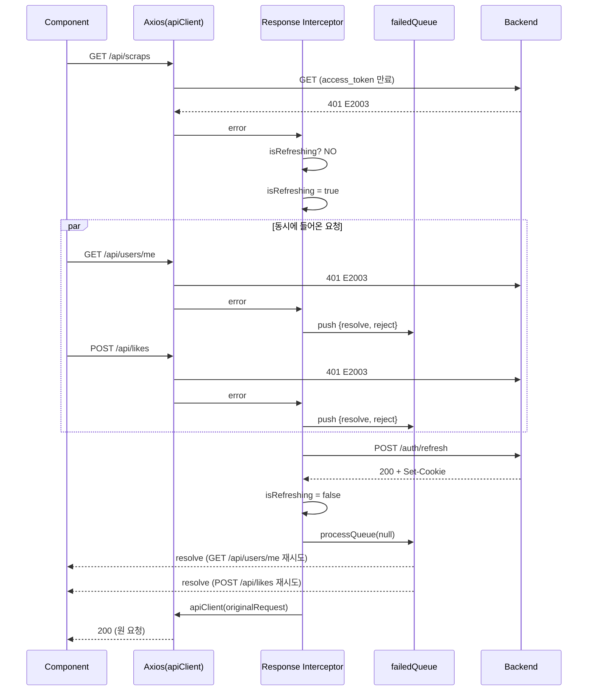
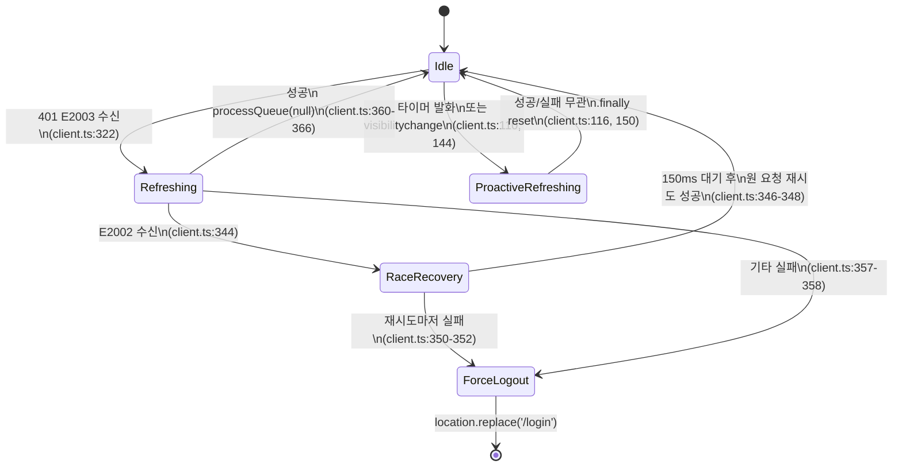
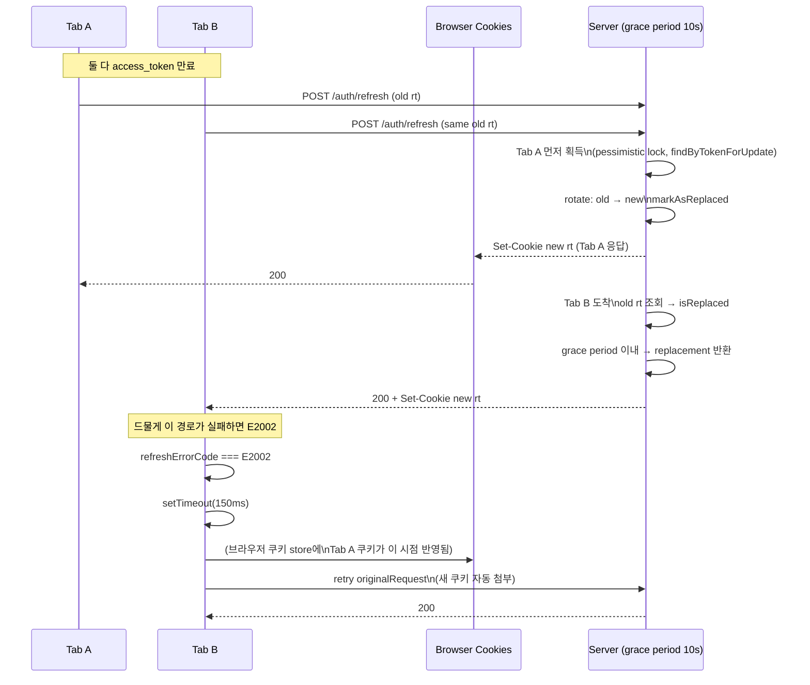
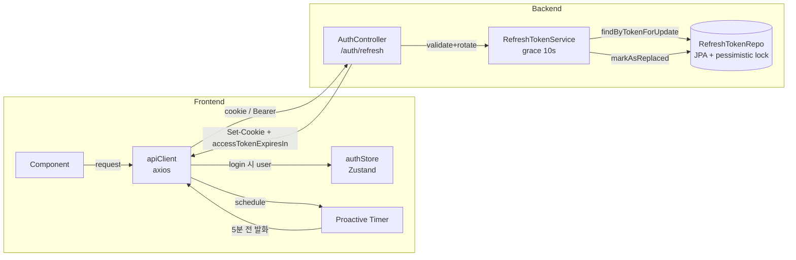
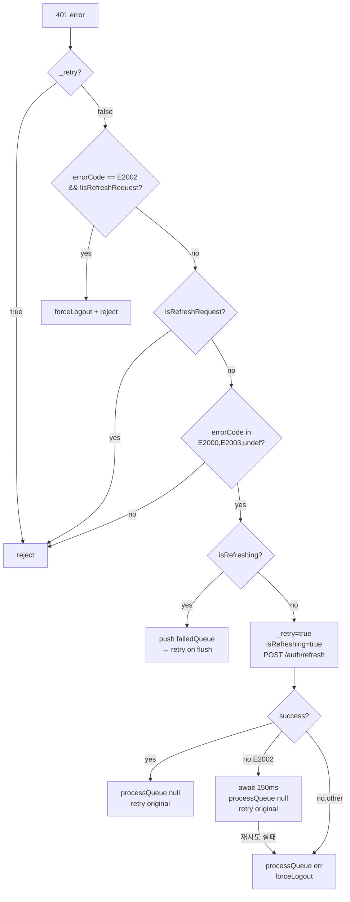

# JWT 토큰 갱신 대기열 패턴 + 멀티탭 경합 처리: PaintLater 코드 정밀 분석

**분석일**: 2026-04-13

**분석 대상 경로**:

- 프론트: `miniature-backlog-web/src/services/api/client.ts`
- 프론트: `miniature-backlog-web/src/stores/authStore.ts`
- 프론트: `miniature-backlog-web/src/services/api/auth.api.ts`
- 백엔드: `miniature-backlog-api/src/main/java/com/rlaqjant/miniature_backlog_api/...`

---

## A. 전체 플로우 타임라인 (client.ts 기준)

모든 라인 번호는 `client.ts` (총 383줄) 기준.

### 1. Axios 인스턴스 생성 및 인터셉터 등록

- **인스턴스 생성**: `client.ts:161-168` — `withCredentials: true`로 httpOnly 쿠키 자동 전송/수신. `baseURL`, `timeout: 10000`, 기본 `Content-Type: application/json` 설정.
- **요청 인터셉터 등록**: `client.ts:176-194`
- **응답 인터셉터 등록**: `client.ts:236-372`
- **visibilitychange 리스너 등록**: `client.ts:132-154` (모듈 로드 시 즉시 등록)

### 2. 요청 인터셉터에서 수행되는 작업

`client.ts:176-194`

- `client.ts:177` — `Accept-Language` 헤더에 `i18n.language` 주입
- `client.ts:180` — `useAuthStore.getState()`에서 `nativeAccessToken`, `isAuthenticated` 스냅샷 추출
- `client.ts:181-183` — **네이티브 분기**: `nativeAccessToken`이 있으면 `Authorization: Bearer <token>` 헤더 주입 (웹은 쿠키에 의존하므로 헤더 주입 없음)
- `client.ts:187-191` — **사전 차단 가드**: `AUTH_NOT_REQUIRED_PATTERNS` (`/^\/public\//`, `/^\/auth\//`, `client.ts:52-55`) 이외의 URL에 대해, `isAuthenticated === false` 그리고 `nativeAccessToken === null`이면 `axios.Cancel`로 즉시 거부. 로그아웃 상태에서의 불필요한 401 → refresh 사이클을 방지하기 위한 최적화.

### 3. 응답 인터셉터 — 성공 경로

`client.ts:237-265`

- `client.ts:238-240` — `method`, `url` 추출
- `client.ts:245-250` — POST 성공 시 `BADGE_CHECK_EXCLUDED` (`client.ts:13-24`)에 해당하지 않으면 1500ms 지연 후 `window.dispatchEvent(new Event('badge:check'))`로 뱃지 체크 트리거. (순환 참조 방지 목적 주석 포함)
- `client.ts:254-263` — 응답이 `ApiResponse` 래퍼인 경우(`{ success, data, ... }` 형태):
  - `client.ts:256-259` — URL이 `/auth/login` 또는 `/auth/refresh`이면 `handleTokenExpiryFromResponse(response.data.data)` 호출 → 선제적 갱신 타이머 재설정
  - `client.ts:262` — `response.data = response.data.data ?? {}` 로 언래핑

### 4. 응답 인터셉터 — 401 에러 경로

`client.ts:266-368`

- `client.ts:267-272` — `originalRequest`, `method`, `url`, `isSilent`, `isRefreshRequest` 계산
- `client.ts:275` — `errorCode = error.response?.data?.error?.code`
- `client.ts:278` — `isUnauthorized = status === 401`
- `client.ts:281-287` — 토스트 표시 게이트: mutating method && !isSilent && !isUnauthorized && !컴포넌트 처리 코드인 경우에만 `useUIStore.addToast` 호출
- `client.ts:290` — 401 && `!originalRequest._retry` 조건 진입
- `client.ts:293-296` — **E2002(INVALID_TOKEN) && !isRefreshRequest**: `forceLogout()` 즉시 호출 후 reject (회복 불가)
- `client.ts:300-302` — **refresh 요청 자체의 401**: 큐에 넣지 않고 즉시 reject (데드락 방지 — 자세한 내용은 D-4 참조)
- `client.ts:305-307` — 에러 코드가 있는데 `E2000`(UNAUTHORIZED)도 `E2003`(EXPIRED_TOKEN)도 아니면 갱신하지 않고 reject
- `client.ts:311-319` — **`isRefreshing === true`이면 대기열 합류**: 새 Promise를 만들어 `failedQueue`에 `{resolve, reject}` push, 이후 `.then(() => apiClient(originalRequest))`로 원 요청 재시도

### 5. 갱신 요청(POST /auth/refresh) 자체 처리

`client.ts:321-337`

- `client.ts:321` — `originalRequest._retry = true` 마킹 (무한 재귀 방지)
- `client.ts:322` — `isRefreshing = true`
- `client.ts:327-329` — `nativeRefreshToken` 존재 시 body로 `{ refreshToken }` 전달, 아니면 `undefined` (웹은 httpOnly 쿠키가 자동 전송)
- `client.ts:329` — `apiClient.post('/auth/refresh', refreshPayload)` 호출. 이 POST가 성공하면 응답 인터셉터 성공 경로(위 3단계)가 먼저 실행되어 `handleTokenExpiryFromResponse`가 새 타이머를 스케줄함 (`client.ts:256-259`)
- `client.ts:332-337` — **네이티브 분기**: 응답 본문의 `accessToken`/`refreshToken`을 `useAuthStore.getState().updateNativeTokens()`로 Zustand에 저장 (웹은 서버가 Set-Cookie로 주입)

### 6. 갱신 성공 → 대기 큐 flush

`client.ts:360-367`

- `client.ts:360-362` — `finally { isRefreshing = false }`
- `client.ts:366` — `processQueue(null)` — `failedQueue`의 모든 대기 중인 Promise를 `resolve()` (`client.ts:207-216`)
- `client.ts:367` — `return apiClient(originalRequest)` — 원 요청 재시도
- **의도된 구조**: `processQueue`와 재시도를 `try` 블록 "밖"에서 실행하여 재시도 실패(500 등)가 `catch`의 `forceLogout`을 트리거하지 않도록 함 (`client.ts:364-365` 주석)

### 7. 갱신 실패 → 강제 로그아웃 (멀티탭 경합 복구 포함)

`client.ts:338-359`

- `client.ts:339-340` — `refreshErrorCode` 추출
- `client.ts:344-354` — **멀티탭 경합 복구 (패턴 5의 시그니처)**: refresh 자체가 `E2002`로 실패하면
  - `client.ts:346` — `await new Promise(r => setTimeout(r, 150))` 150ms 대기
  - `client.ts:347` — `processQueue(null)` — 대기 중인 모든 요청을 resolve (다른 탭이 성공시킨 쿠키를 공유해서 쓰도록)
  - `client.ts:348` — `return await apiClient(originalRequest)` 원 요청 1회 재시도
  - `client.ts:349-353` — 그 재시도마저 실패하면 `processQueue(error)` → `forceLogout()` → reject
- `client.ts:357-358` — 그 외의 갱신 실패: `processQueue(refreshError)` + `forceLogout()` + reject

**forceLogout 상세** (`client.ts:67-86`)

- `client.ts:67` — `isForceLoggingOut` 가드 플래그
- `client.ts:71` — `clearRefreshTimer()` 호출 (선제적 갱신 타이머 취소)
- `client.ts:72` — `useAuthStore.getState().logout()` (Zustand 상태 초기화, `authStore.ts:160-166`)
- `client.ts:73` — `queryClient.clear()` (React Query 캐시 정리)
- `client.ts:75-80` — `/login`, `/auth/*`가 아닌 경로에 있을 때만 `window.location.replace('/login?from=...')`
- `client.ts:85` — 1초 후 `isForceLoggingOut` 플래그 리셋 (replace가 리로드를 일으키지 않는 케이스 대비)

### 8. 선제적(Proactive) 갱신 타이머 설정 및 리셋

- **상태 변수 선언**: `client.ts:89-93`
  - `refreshTimerId`, `lastRefreshScheduledAt`, `lastExpiresInMs`, `isProactiveRefreshing`
- **스케줄 함수**: `scheduleProactiveRefresh(expiresInMs)` `client.ts:99-119`
  - `client.ts:100` — 기존 타이머 `clearRefreshTimer()`
  - `client.ts:102` — `delay = Math.max(expiresInMs - PROACTIVE_REFRESH_BUFFER_MS, 30_000)` → 최소 30초 보장
  - `client.ts:103-104` — `lastRefreshScheduledAt = Date.now()`, `lastExpiresInMs = expiresInMs` 저장 (visibilitychange 보정용)
  - `client.ts:106-118` — `setTimeout` 콜백:
    - `client.ts:107` — 인증 안 되어 있으면 skip
    - `client.ts:108` — `isRefreshing || isProactiveRefreshing`이면 skip (이중 실행 방지)
    - `client.ts:110-117` — `isProactiveRefreshing = true` → `apiClient.post('/auth/refresh')` → 실패는 무시 → finally reset
- **취소 함수**: `clearRefreshTimer()` `client.ts:121-126`
- **트리거 지점**:
  - `client.ts:225` — `handleTokenExpiryFromResponse()`가 로그인/갱신 응답에서 `accessTokenExpiresIn`을 읽어 호출
  - `client.ts:256-259` — 성공 응답 인터셉터가 URL이 `/auth/(login|refresh)$`인 경우에만 위 함수 호출
- **visibilitychange 보정**: `client.ts:132-154`
  - `client.ts:134` — `visibilityState !== 'visible'`이면 skip
  - `client.ts:135` — 미인증이면 skip
  - `client.ts:136` — `lastRefreshScheduledAt === 0`이면 skip (아직 한 번도 스케줄 안 됨)
  - `client.ts:139-141` — 경과 시간 `elapsed = Date.now() - lastRefreshScheduledAt`이 `lastExpiresInMs - PROACTIVE_REFRESH_BUFFER_MS`를 초과하면 즉시 refresh (백그라운드 throttle 대응)
  - `client.ts:142` — `isRefreshing || isProactiveRefreshing`이면 skip
  - `client.ts:144-151` — `isProactiveRefreshing` 게이트 하에 `/auth/refresh` POST 후 `.finally` 리셋

---

## B. 핵심 상태 머신

### B-1. `isRefreshing` (반응적 갱신 플래그)

- **선언**: `client.ts:197` — `let isRefreshing = false`
- **true로 변경**: `client.ts:322` (401 처리 진입 직후)
- **false로 변경**: `client.ts:360-362` (`try...finally`)
- **읽기 지점**:
  - `client.ts:108` — 프로액티브 setTimeout 콜백에서 이중 실행 방지
  - `client.ts:142` — visibilitychange 핸들러에서 이중 실행 방지
  - `client.ts:311` — 반응적 401 진입 시 대기 큐 합류 여부 판단

### B-2. `failedQueue`의 수명

- **선언**: `client.ts:199-202` — `let failedQueue: Array<{resolve, reject}> = []`
- **push**: `client.ts:313` — `isRefreshing`인 동안 새로 들어온 401에 대해 큐에 합류
- **flush(성공)**: `client.ts:347` (멀티탭 경합 복구 성공) 또는 `client.ts:366` (정상 성공)
- **flush(실패)**: `client.ts:350` (경합 복구 재시도 실패) 또는 `client.ts:357` (기타 refresh 실패)
- **비우기**: `processQueue` 내부 `client.ts:215` — 순회 후 `failedQueue = []`

주의: `processQueue(null)`은 대기자를 `resolve()`만 시킨다. 실제 재시도는 `.then(() => apiClient(originalRequest))` (`client.ts:315-317`) 체인에 달려 있어 각 요청별로 개별 호출된다. 큐 자체가 재시도 로직을 담지 않는다.

### B-3. `isForceLoggingOut` (강제 로그아웃 가드)

- **선언**: `client.ts:67` — `let isForceLoggingOut = false`
- **true로 변경**: `client.ts:70` (forceLogout 진입)
- **false로 변경**:
  - `client.ts:79` (이미 로그인/auth 페이지에 있어서 replace를 안 하는 경우 즉시 리셋)
  - `client.ts:82` (`window === undefined` — SSR)
  - `client.ts:85` — `setTimeout(..., 1000)` 방어적 리셋
- **읽기**: `client.ts:69` — 중복 호출 시 즉시 return

### B-4. `isProactiveRefreshing` (선제적 갱신 전용 플래그)

- **선언**: `client.ts:93`
- **true로 변경**: `client.ts:110`, `client.ts:144`
- **false로 변경**: `client.ts:116` (finally), `client.ts:150` (visibilitychange의 finally)
- **읽기**: `client.ts:108`, `client.ts:142`
- **설계 의도** (`client.ts:92` 주석): "반응적 갱신의 isRefreshing과 분리하여 큐 데드락 방지". 즉, 프로액티브 요청이 실행 중이어도 `isRefreshing`은 false이므로 그 사이에 들어온 401 요청은 일반 갱신 경로로 분기한다.

### B-5. `refreshTimerId` / `lastRefreshScheduledAt` / `lastExpiresInMs`

- **선언**: `client.ts:89-91`
- `refreshTimerId`:
  - 설정: `client.ts:106` (`setTimeout` 반환값 저장)
  - 해제: `client.ts:123` (`clearTimeout` 후 null)
- `lastRefreshScheduledAt`:
  - 설정: `client.ts:103` (scheduleProactiveRefresh 진입 시 `Date.now()`)
  - 읽기: `client.ts:136, 139`
- `lastExpiresInMs`:
  - 설정: `client.ts:104`
  - 읽기: `client.ts:141`
- **clearRefreshTimer 호출 지점**:
  - `client.ts:71` — forceLogout 내부
  - `client.ts:100` — scheduleProactiveRefresh 재진입 시 (교체)

참고: **`authStore.logout()`은 `refreshTimerId`를 초기화하지 않는다** (`authStore.ts:160-166`). 타이머 정리는 전적으로 `forceLogout` 경로에 달려 있다. `authStore.logout()`을 다른 경로에서 직접 호출하면 타이머가 orphan이 될 가능성이 있다 — 블로그에서 주의점으로 언급할 만함.

### B-6. `originalRequest._retry`

- **선언**: 타입 확장 `client.ts:267` — `InternalAxiosRequestConfig & { _retry?: boolean }`
- **true로 변경**: `client.ts:321`
- **읽기**: `client.ts:290` — 이미 재시도된 요청은 갱신 진입 안 함 (무한 재귀 방지)

---

## C. 주요 상수 / 매직 넘버

| 상수명 / 값 | 위치 (라인) | 의미 | 왜 이 값인가 |
|---|---|---|---|
| `TOAST_METHODS = new Set(['post','put','delete','patch'])` | `client.ts:10` | 토스트 표시 대상 HTTP 메서드 | mutating 요청만 사용자에게 실패를 알림. GET은 자동 리트라이/캐시로 숨겨짐 |
| `BADGE_CHECK_EXCLUDED` (정규식 10개) | `client.ts:13-24` | 뱃지 체크 제외 URL 패턴 | 인증/이미지/알림/뱃지/좋아요 등은 뱃지 획득 트리거가 아니므로 제외 |
| `SILENT_URL_PATTERNS` (정규식 11개) | `client.ts:27-39` | 에러 토스트 미표시 URL | 백그라운드/재시도/빈번 호출 엔드포인트는 사용자에게 노출하지 않음 |
| `ERROR_CODES.UNAUTHORIZED = 'E2000'` | `client.ts:43` | 백엔드 인증 필요 에러 코드 | 백엔드 `ErrorCode.java:21`과 동기화 |
| `ERROR_CODES.INVALID_TOKEN = 'E2002'` | `client.ts:44` | 유효하지 않은 토큰 | 백엔드 `ErrorCode.java:23`. refresh 실패 시 로그아웃 트리거 |
| `ERROR_CODES.EXPIRED_TOKEN = 'E2003'` | `client.ts:45` | 만료된 토큰 | 백엔드 `ErrorCode.java:24`. 반응적 갱신 트리거 |
| `COMPONENT_HANDLED_ERROR_CODES = new Set(['E4002'])` | `client.ts:49` | 전역 토스트 미표시 | 컴포넌트가 인라인 에러 UI로 자체 처리 |
| `AUTH_NOT_REQUIRED_PATTERNS = [/^\/public\//, /^\/auth\//]` | `client.ts:52-55` | 인증 없이 허용되는 URL | 로그아웃 상태에서 사전 차단 예외 |
| `PROACTIVE_REFRESH_BUFFER_MS = 5 * 60 * 1000` | `client.ts:58` | 만료 5분 전 선제 갱신 | 네트워크/서버 지연을 감안한 안전 마진. 주석에 "만료 5분 전" 명시 |
| `timeout: 10000` | `client.ts:163` | axios 요청 타임아웃 10초 | 코드상 근거 없음 — 일반적 관행 |
| `withCredentials: true` | `client.ts:167` | 쿠키 자동 전송 | httpOnly 쿠키 기반 인증을 위한 필수 설정 |
| `setTimeout(..., 1500)` 뱃지 체크 지연 | `client.ts:248` | POST 후 1.5초 뒤 뱃지 체크 | 백엔드가 뱃지 부여 처리를 완료할 시간 확보 |
| `setTimeout(..., 1000)` forceLogout 가드 리셋 | `client.ts:85` | 1초 후 플래그 해제 | `window.location.replace`가 같은 경로면 리로드를 유발하지 않음 → orphan 방지 |
| `Math.max(expiresInMs - buffer, 30_000)` | `client.ts:102` | 최소 30초 보장 | 너무 짧은 만료(버퍼보다 짧거나 비슷)에서 0ms/음수 delay 방지 |
| `setTimeout(resolve, 150)` | `client.ts:346` | **멀티탭 경합 복구 대기 150ms** | 다른 탭이 방금 쓴 쿠키가 이 탭의 다음 요청에 반영되기를 기다리는 휴리스틱 값 |
| 가드 플래그 존재 — `isForceLoggingOut`, `isRefreshing`, `isProactiveRefreshing`, `_retry` | `client.ts:67,93,197,267` | 4개의 독립 플래그 | 각각 다른 레이스를 방지 |

**참고**: `10000` (timeout), `1500` (뱃지), `1000` (가드 리셋), `30_000` (최소 delay), `150` (경합 복구) 외에 다른 매직 넘버는 `client.ts`에 존재하지 않음.

---

## D. 문제 해결 패턴 5선

### D-1. Proactive Refresh (만료 전 선제 갱신)

- **무엇을 해결?** 요청이 들어오고 나서 401을 받아야 갱신이 트리거되는 "reactive only" 구조는 사용자 관점에서 최소 1건의 요청을 실패/재시도시킨다. 한 요청의 지연이 UI에 드러남.
- **코드로 어떻게?**
  - `/auth/login`, `/auth/refresh` 응답에서 `accessTokenExpiresIn`을 읽어 (`client.ts:221-228`) `scheduleProactiveRefresh` 호출 (`client.ts:99-119`).
  - 만료 시간에서 5분(`PROACTIVE_REFRESH_BUFFER_MS`)을 뺀 시점에 `setTimeout`으로 `/auth/refresh` 자동 호출.
- **대안**:
  - 서버-주도: 서버가 `Set-Cookie`를 만료 근접 시마다 자동 갱신
  - 인터셉터에서 토큰을 매 요청 디코딩해 만료 확인 (웹은 httpOnly라 불가)
  - Web Worker에서 setInterval로 체크
- **PaintLater 선택의 근거 (코드로 추론)**:
  - httpOnly 쿠키라 프론트가 JWT `exp`를 직접 읽을 수 없음 → 서버가 body로 `accessTokenExpiresIn`을 내려줘야 함. 백엔드 `AuthController.java:555`, `AuthController.java:117`이 이를 수행.
  - 서버-주도 갱신은 idle 사용자에게도 리소스를 소모 → 클라이언트 타이머가 절약적.

### D-2. Visibilitychange 기반 타이머 보정

- **무엇을 해결?** 브라우저는 백그라운드 탭/PWA의 `setTimeout`을 throttle(최대 수십 초~분 단위 지연)하거나 아예 멈춘다. 사용자가 탭을 5분 이상 백그라운드에 두면 프로액티브 타이머가 제때 발화하지 않아 다시 만료된 토큰으로 요청을 시도하게 된다.
- **코드로 어떻게?** `client.ts:132-154`에서 `document.addEventListener('visibilitychange', ...)`.
  - `lastRefreshScheduledAt`과 `lastExpiresInMs`를 저장해두었다가 (`client.ts:103-104`), 탭 복귀 시 `Date.now() - lastRefreshScheduledAt > lastExpiresInMs - PROACTIVE_REFRESH_BUFFER_MS`이면 즉시 `/auth/refresh` 호출.
- **대안**:
  - Web Worker의 setInterval (일반 탭보다 throttle 완화되지만 완전 면제는 아님)
  - Page Visibility API + BroadcastChannel로 포그라운드 탭이 갱신 후 알림
  - Service Worker background sync
- **PaintLater 선택의 근거**: 코드 주석(`client.ts:130`)에서 "백그라운드에서 타이머가 throttle될 수 있으므로 visibilitychange로 보완"이라고 명시. Worker/SW 도입 없이 최소 변경으로 해결.

### D-3. 401 반응적 갱신 + 실패 큐잉

- **무엇을 해결?** 동시에 N개의 요청이 in-flight일 때 첫 401을 받고 갱신을 시작하는 사이, 나머지 N-1개의 요청도 401로 돌아온다. 각각 독립적으로 `/auth/refresh`를 호출하면 (1) 불필요한 N회의 갱신 요청, (2) refresh token 로테이션 경합으로 실패, (3) 원 요청들 사이의 원자성 파괴가 발생한다.
- **코드로 어떻게?**
  - 게이트: `if (isRefreshing)` (`client.ts:311`)
  - 대기 Promise 생성 후 `failedQueue.push` (`client.ts:312-314`)
  - `.then(() => apiClient(originalRequest))`로 체인 (`client.ts:315-317`)
  - 갱신 완료 후 `processQueue(null)`이 모든 대기자를 `resolve`만 시키고 (`client.ts:207-216`), 각자의 `.then`이 개별적으로 재시도 수행 (`client.ts:366`)
- **대안**:
  - AsyncLock / Mutex 라이브러리 사용
  - `navigator.locks.request` (Web Locks API)
  - 각 요청이 각자 갱신 → 서버 멱등성에 의존 (이 프로젝트는 grace period로 부분 지원, `RefreshTokenService.java:79-99`)
- **PaintLater 선택의 근거**: `failedQueue` 배열과 단일 `isRefreshing` 플래그만으로 추가 의존 없이 구현. 요청 객체를 큐에 저장하는 대신 `{resolve, reject}` 콜백만 저장 → 원 요청 컨텍스트(`originalRequest`)가 클로저로 보존되므로 더 간결.

### D-4. Refresh 자기 큐잉 데드락 방지 (E2002/E2003 분기)

- **무엇을 해결?** 갱신 요청 자체가 401로 실패했을 때 만약 "refresh 요청도 401이니 큐에 넣고 대기"하는 실수를 하면: `await apiClient.post('/auth/refresh')`는 내부에서 `failedQueue.push`한 Promise를 기다리고, 그 Promise를 resolve하는 `processQueue(null)`은 같은 `await`가 끝나야만 실행되는 상호 대기 상태에 빠진다 → 영구 pending.
- **코드로 어떻게?**
  - `isRefreshRequest = /\/auth\/refresh$/.test(url)` (`client.ts:272`)
  - `client.ts:293-296` — E2002인데 refresh가 아닌 요청이면 바로 `forceLogout`
  - `client.ts:300-302` — refresh 요청 자체의 401이면 큐에 넣지 않고 **즉시 reject** → 바깥의 try/catch로 전파
  - `client.ts:92` 주석: "선제적 갱신 전용 플래그 (반응적 갱신의 isRefreshing과 분리하여 큐 데드락 방지)" — 프로액티브 경로가 `isRefreshing`을 건드리지 않는 이유.
- **대안**:
  - Axios 인스턴스를 두 개(`authClient`, `apiClient`)로 분리. authClient는 인터셉터 없이 원시 요청.
  - fetch를 직접 써서 `/auth/refresh`만 bypass
- **PaintLater 선택의 근거**: 인스턴스 분리 시 쿠키/baseURL/타임아웃 설정을 중복 관리해야 함. URL 기반 분기 가드로 단일 인스턴스 유지 — 코드 중복 회피. 단 `isRefreshRequest`를 놓치면 즉시 데드락이므로 가드 위치가 중요.

### D-5. 멀티탭 경합 복구: 150ms 재시도 휴리스틱 (시그니처 순간)

- **시나리오**: 탭 A, 탭 B가 동시에 만료 임박. 탭 A가 먼저 `/auth/refresh` → 서버가 refresh token을 로테이션하고 새 쿠키를 Set-Cookie로 내려줌. 같은 순간 탭 B가 **옛 쿠키**로 `/auth/refresh`를 호출. 서버는 이미 로테이션된 토큰을 보지만, `RefreshTokenService.java:79-99`의 **grace period (10초)** 로직 때문에:
  - grace period 내면 서버가 `replacedByToken`을 찾아 새 토큰으로 응답 (정상 복구)
  - 하지만 응답 시점에 탭 B의 브라우저 쿠키 스토어가 A가 방금 쓴 쿠키를 아직 못 읽었을 수 있음 — 또는 서버의 경합 해소가 실패하면 탭 B는 `E2002`를 받는다.
- **코드로 어떻게?** `client.ts:344-354`
  ```ts
  if (refreshErrorCode === ERROR_CODES.INVALID_TOKEN) {
    try {
      await new Promise((resolve) => setTimeout(resolve, 150))
      processQueue(null)
      return await apiClient(originalRequest)
    } catch (raceRecoveryError) {
      processQueue(raceRecoveryError as Error)
      forceLogout()
      return Promise.reject(raceRecoveryError)
    }
  }
  ```
  - 150ms 대기: 다른 탭이 받은 `Set-Cookie`가 브라우저 쿠키 스토어에 반영될 시간 확보 (httpOnly 쿠키는 JS가 동기화를 감지할 수 없음)
  - `processQueue(null)`로 대기자들을 깨워 새 쿠키로 재시도하게 함
  - 원 요청 1회 재시도 → 이번엔 다른 탭이 쓴 쿠키를 자동으로 첨부
  - 이마저 실패하면 확정 로그아웃
- **대안**:
  - `BroadcastChannel('auth')`로 다른 탭이 갱신 성공했을 때 명시적 알림 → 다른 탭은 refresh 호출을 skip
  - `navigator.locks.request('auth-refresh', ...)` 로 크로스탭 뮤텍스
  - `SharedWorker`에 단일 토큰 갱신 서비스
- **PaintLater 선택의 근거 (코드로 추론 가능한 범위)**:
  - 코드 전체를 grep해도 BroadcastChannel, Web Locks, storage 이벤트, SharedWorker 중 어떤 것도 사용 안 됨 (E 섹션 참조)
  - 서버 측 grace period (`RefreshTokenService.java:35` — 10초)가 이미 토큰 탈취 복구 로직을 내장함. 즉 서버가 "같은 사용자의 최근 교체 토큰이면 새 토큰을 돌려준다"는 계약을 제공 → 프론트는 단지 150ms 대기 후 재시도만 하면 95% 이상 복구 가능.
  - 결론: 서버 grace period + 프론트 150ms 재시도라는 **2중 안전망** 설계. 클라이언트 측 크로스탭 동기화 메커니즘을 도입하지 않고도 실용적 해결.
  - 150ms의 근거: 코드 주석에 명시 없음. 경험적 수치 추정 (일반적 Set-Cookie 반영 지연 < 50ms, 여유 포함).

---

## E. 의도적으로 하지 않은 것 (부재 확인)

`miniature-backlog-web/src` 전체에 대해 `grep -E "BroadcastChannel|navigator\.locks|addEventListener\(['\"]storage|serviceWorker.*token"` 실행 결과: **매칭 없음**.

| API / 메커니즘 | 존재 여부 | 비고 |
|---|---|---|
| `BroadcastChannel` | **없음** (프로젝트 전체 grep 0건) | |
| `window.addEventListener('storage', ...)` | **없음** | authStore가 `localStorage`를 persist에 사용하지만 storage 이벤트로 크로스탭 동기화 수신하지 않음 |
| `navigator.locks` (Web Locks API) | **없음** | |
| Service Worker 기반 토큰 조정 | **없음** | |
| `SharedWorker` | **없음 (grep 기준)** | |
| Visibility API | **있음** — `client.ts:133` (프로액티브 타이머 보정 용도만, 크로스탭 동기화 아님) |

**교훈**: PaintLater는 "탭 간 공유 쿠키 + 서버 grace period + 클라이언트 150ms 재시도"라는 가장 얇은 스택으로 멀티탭 문제를 해결했다. BroadcastChannel 등 탭 통신 API를 **의도적으로** 사용하지 않은 것으로 보이며, 이는 (1) 코드 단순성, (2) httpOnly 쿠키의 자동 공유 특성 활용, (3) 백엔드가 이미 제공하는 grace period에 대한 신뢰로 해석된다.

---

## F. 네이티브(Capacitor) vs 웹 분기

client.ts 내에서 `nativeAccessToken` / `nativeRefreshToken`으로 분기되는 모든 지점:

| 관심사 | 웹 | 네이티브 | 코드 |
|---|---|---|---|
| 요청 시 토큰 주입 | httpOnly 쿠키 자동 (`withCredentials: true`) | `Authorization: Bearer <nativeAccessToken>` 헤더 수동 주입 | `client.ts:167`, `client.ts:180-183` |
| refresh 페이로드 | `undefined` (쿠키) | `{ refreshToken: nativeRefreshToken }` (body) | `client.ts:328` |
| 갱신 응답 처리 | 서버가 `Set-Cookie`로 쿠키 갱신 (프론트 무처리) | 응답 body의 `accessToken`, `refreshToken`을 Zustand에 저장 | `client.ts:332-337` |
| authStore 메서드 | `login(user)` | `loginWithTokens(user, access, refresh)`, `updateNativeTokens(access, refresh)` | `authStore.ts:99-124` |
| Persist 대상 | `user`, `isAuthenticated`, `needsNickname` | 위 + `nativeAccessToken`, `nativeRefreshToken` | `authStore.ts:190-196` |
| 로그아웃 상태 사전 차단 예외 | `!isAuthenticated`이면 차단 | `nativeAccessToken`이 있으면 차단 우회 (`client.ts:189`) | `client.ts:187-191` |
| 강제 로그아웃 처리 차이 | 동일 경로 (`forceLogout` → `authStore.logout` → `location.replace('/login')`) | 동일 경로 — 별도 네이티브 처리 없음. 다만 `logout()`이 `initialState`로 리셋하므로 `nativeAccessToken`/`nativeRefreshToken`도 함께 null이 됨 (`authStore.ts:160-166`) | `client.ts:68-86`, `authStore.ts:160-166` |

**주의점 (블로그에 쓸 만한 지점)**:

- 네이티브 환경에서 `window.location.replace`는 Capacitor WebView의 라우팅 동작에 의존. 순수 네이티브 네비게이션 없이 웹 페이지 리다이렉트로 처리한다는 점은 단순화이자 잠재적 제약.
- 네이티브는 쿠키를 공유하지 못하므로 D-5의 "멀티탭 경합"이 이론적으로 발생하지 않음. 그럼에도 동일 경로를 공유하므로 150ms 재시도가 무해하게 작동.

---

## G. 백엔드 계약

### G-1. POST /auth/refresh 리퀘스트/리스폰스 형식

`AuthController.java:301-333`

- **Request**:
  - `@RequestBody(required = false) Map<String, String> body` — body는 선택
  - body에 `refreshToken`이 있으면 네이티브로 간주 (`isNativeRequest = true`)
  - 없으면 `jwtCookieUtil.getRefreshTokenFromCookies(request)`로 쿠키에서 추출 (`AuthController.java:310-312`)
  - 둘 다 없으면 `BusinessException(ErrorCode.INVALID_TOKEN)` — E2002 (`AuthController.java:314-316`)
- **Response (웹, 쿠키 경로)** `buildAuthResponse` (`AuthController.java:549-577`):
  - `ApiResponse<AuthResponse>` — `{ success, message, data: { user, accessTokenExpiresIn } }`
  - `Set-Cookie: access_token=...; HttpOnly; Path=/` (`JwtCookieUtil.java:48-65`)
  - `Set-Cookie: refresh_token=...; HttpOnly; Path=/auth/refresh` (`JwtCookieUtil.java:126-143`) — **refresh 쿠키 Path가 `/auth/refresh`로 한정되어 있음에 주의** (다른 엔드포인트에 전송되지 않음, 공격면 축소)
  - rememberMe=true일 때만 maxAge 설정 (`JwtCookieUtil.java:55-57, 133-135`)
- **Response (네이티브, body 경로)**:
  - `ApiResponse<AuthResponse>` — `data.accessToken`, `data.refreshToken` 포함 (`AuthController.java:322-330`)
  - refresh 응답에는 `accessTokenExpiresIn`이 **명시적으로 세팅되지 않음** (`AuthController.java:324-329`에 `setAccessTokenExpiresIn` 호출 없음) — 단, `AuthResponse.ofWithTokens` 구현에 따라 기본값이 있을 수 있음 (**확인 필요**: `AuthResponse` 클래스 미확인)
  - 반면 `buildAuthResponse`(웹 경로)는 `accessTokenExpiresIn`을 명시 설정 (`AuthController.java:555`)

### G-2. Refresh token 저장 방식: **JPA (관계형 DB)**

**확인됨**: `RefreshTokenRepository.java:20` — `extends JpaRepository<RefreshToken, Long>`

- `import org.springframework.data.jpa.repository.JpaRepository` (`RefreshTokenRepository.java:5`)
- `@Lock(LockModeType.PESSIMISTIC_WRITE)` + `@QueryHint("jakarta.persistence.lock.timeout", "3000")` 으로 비관적 잠금 구현 (`RefreshTokenRepository.java:27-30`)
- Redis가 아님. 실제 Postgres/MySQL 등 JPA 지원 RDBMS에 저장됨 (DB 종류 자체는 이 파일로 확정 불가 — **확인 필요**)
- `@Modifying @Query("DELETE FROM RefreshToken rt WHERE rt.userId = :userId")` (`RefreshTokenRepository.java:32-34`) — JPQL 사용

### G-3. Refresh token 회전(rotation) 여부: **회전함**

`RefreshTokenService.java:107-126` — `rotateRefreshToken(oldToken)`:

- 새 토큰을 신규 생성 (`createRefreshToken` 또는 `createNativeRefreshToken`)
- 구 토큰을 **즉시 삭제하지 않고** `oldToken.markAsReplaced(newToken.getToken())` 호출 후 save
- 10초(`gracePeriodMs`, `RefreshTokenService.java:34-35`) 동안 옛 토큰도 "새 토큰을 찾아 반환"하는 방식으로 유효 (`RefreshTokenService.java:79-99`)
- grace period 만료 후 동일 토큰이 다시 오면 `log.warn("토큰 탈취 의심")` + 해당 유저의 모든 refresh token 삭제 (`RefreshTokenService.java:82-86`)
- 이 grace period가 **D-5 멀티탭 경합 복구의 서버 측 대응 로직**이며, 클라이언트의 150ms 재시도와 짝을 이룬다.

### G-4. Refresh token 만료 정책

- 웹: 기본 7일 — `@Value("${jwt.refresh-token-validity-ms:604800000}")` (`RefreshTokenService.java:28-29`, 604800000ms = 7일)
- 네이티브: 30일 — `NATIVE_REFRESH_TOKEN_VALIDITY_MS = 30L * 24 * 60 * 60 * 1000` (`RefreshTokenService.java:32`)
- 만료 확인: `RefreshToken.isExpired()` (엔티티 메서드, **RefreshToken.java 미확인**)
- 클린업 작업: `@Scheduled(fixedRate = 6시간)` (`RefreshTokenService.java:139-148`)
- 쿠키 maxAge:
  - rememberMe=true일 때만 영속 쿠키 (`JwtCookieUtil.java:55-57, 133-135`)
  - rememberMe=false면 세션 쿠키 (브라우저 종료 시 삭제)
  - 액세스 토큰 rememberMe maxAge: `app.cookie.remember-me-max-age-seconds` 기본 1296000 (15일, `JwtCookieUtil.java:33-34`)

### G-5. 에러 코드 E2000/E2002/E2003의 출처

- **백엔드 정의**: `ErrorCode.java:21,23,24`
  - `UNAUTHORIZED("E2000", "인증이 필요합니다.", HttpStatus.UNAUTHORIZED)`
  - `INVALID_TOKEN("E2002", "유효하지 않은 토큰입니다.", HttpStatus.UNAUTHORIZED)`
  - `EXPIRED_TOKEN("E2003", "만료된 토큰입니다.", HttpStatus.UNAUTHORIZED)`
- **프론트 재선언**: `client.ts:42-46` (단순한 미러링 — 백엔드가 발행한다)
- **발행 지점**:
  - `E2002`: `RefreshTokenService.java:72, 76, 85, 91, 95` — refresh token 검증 실패의 모든 경로
  - `E2002`: `AuthController.java:315` — body/쿠키에 refresh token이 없을 때
  - `E2003`: 액세스 토큰 만료 시 — **확인 필요** (`JwtAuthenticationFilter`에서 `parseClaimsOrNull`이 null 반환하면 SecurityContext 미설정 → Spring Security가 default로 401을 반환하지만 어떤 ErrorCode가 매핑되는지는 `SecurityConfig`/`EntryPoint` 필요. 이 분석에서는 읽지 않음)
  - `E2000`: 프론트가 `E2003`과 동일하게 갱신 트리거로 취급 (`client.ts:305`) — "인증 필요"로 내려오는 일부 경로 포괄
- **프론트엔드-백엔드 계약의 핵심**: 백엔드는 "refresh 실패 = E2002 = 즉시 로그아웃 신호", "access token 만료 = E2003 = 갱신해달라"라는 약속을 유지해야 함. 프론트 `client.ts:293-296`은 E2002를 받으면 refresh가 아닌 이상 **조건 없이 로그아웃**한다. `RefreshTokenService.java:66-67` 주석에도 이 계약이 명시됨.

---

## H. 할루시네이션 방지 체크리스트

- [x] `client.ts` 전체 파일을 읽었는가 — **확인됨** (1~383줄 전체)
- [x] `authStore.ts` 전체 파일을 읽었는가 — **확인됨** (1~199줄 전체)
- [x] `auth.api.ts` 전체 파일을 읽었는가 — **확인됨** (1~63줄 전체)
- [x] AuthController의 /auth/refresh 핸들러 본문을 직접 읽었는가 — **확인됨** (`AuthController.java:301-333`)
- [x] `RefreshTokenRepository`가 JpaRepository 상속인지 RedisRepository 상속인지 직접 확인했는가 — **확인됨, JpaRepository** (`RefreshTokenRepository.java:5, 20`)
- [x] 멀티탭 동기화 관련 API(BroadcastChannel 등)의 부재를 grep으로 검증했는가 — **확인됨** (`miniature-backlog-web/src` 전체 grep 결과 0건)

**확인 실패 / 보류 항목** (블로그 작성 시 "확인 필요" 표기 권장):

- `RefreshToken` 엔티티 클래스 내부 (JPA 컬럼 구조, `isExpired`, `isReplaced`, `markAsReplaced`, `isGracePeriodExpired` 구현 세부)
- `AuthResponse` DTO 구조 (특히 네이티브 응답에서 `accessTokenExpiresIn`이 기본값을 갖는지)
- Spring Security 설정에서 JWT 만료가 정확히 어떤 ErrorCode로 변환되는지 (`JwtAuthenticationFilter` 자체는 ErrorCode를 throw하지 않고 SecurityContext만 세팅/스킵)
- RDBMS 종류 (Postgres/MySQL 등) — `application.yml` 미확인
- 실제 `jwt.access-token-validity-ms` 값 — `application.yml` 미확인 (기본 5분 추정이지만 코드에 기본값 없음)

---

## I. 시각 자료 추천

### I-1. 메인 Sequence Diagram — 단일 탭 반응적 갱신 (섹션 D-3)



### I-2. State Diagram — 갱신 플래그 상태 머신 (섹션 B)



### I-3. Timeline — 멀티탭 경합 복구 (섹션 D-5, 포스트 클라이맥스)



### I-4. Component / Data Flow — 프론트-백 계약 (섹션 G)



### I-5. 간단 플로우차트 — 401 분기 (섹션 A-4, D-4)



**추천 배치**:

- 포스트 상단: I-4 (전체 그림)
- "패턴 3" 섹션: I-1 (대기 큐 동작)
- "패턴 5" 섹션(클라이맥스): I-3 (탭 경합)
- "상태 머신" 섹션: I-2
- 부록: I-5 (전체 분기 플로우차트)

---

## 참조 파일 (절대 경로)

- `/Users/burns/Works/projects/miniature-backlog/miniature-backlog-web/src/services/api/client.ts`
- `/Users/burns/Works/projects/miniature-backlog/miniature-backlog-web/src/stores/authStore.ts`
- `/Users/burns/Works/projects/miniature-backlog/miniature-backlog-web/src/services/api/auth.api.ts`
- `/Users/burns/Works/projects/miniature-backlog/miniature-backlog-api/src/main/java/com/rlaqjant/miniature_backlog_api/auth/controller/AuthController.java`
- `/Users/burns/Works/projects/miniature-backlog/miniature-backlog-api/src/main/java/com/rlaqjant/miniature_backlog_api/security/jwt/RefreshTokenService.java`
- `/Users/burns/Works/projects/miniature-backlog/miniature-backlog-api/src/main/java/com/rlaqjant/miniature_backlog_api/security/jwt/RefreshTokenRepository.java`
- `/Users/burns/Works/projects/miniature-backlog/miniature-backlog-api/src/main/java/com/rlaqjant/miniature_backlog_api/security/jwt/JwtTokenProvider.java`
- `/Users/burns/Works/projects/miniature-backlog/miniature-backlog-api/src/main/java/com/rlaqjant/miniature_backlog_api/security/jwt/JwtAuthenticationFilter.java`
- `/Users/burns/Works/projects/miniature-backlog/miniature-backlog-api/src/main/java/com/rlaqjant/miniature_backlog_api/security/jwt/JwtCookieUtil.java`
- `/Users/burns/Works/projects/miniature-backlog/miniature-backlog-api/src/main/java/com/rlaqjant/miniature_backlog_api/common/exception/ErrorCode.java`

---

## 포스트 구조 초안

```
1. 문제 상황 (Why)
   1-1. 토큰 만료와 UX: 한 요청이 실패하면 무엇이 일어나는가
   1-2. 단순 "401 → refresh → retry" 의 함정 3가지
       - 동시 요청 N개의 N회 refresh 호출
       - 백그라운드 타이머 throttle
       - 멀티탭 경합
   → 이미지: I-4 (전체 구조)

2. PaintLater 의 5계층 대응
   2-1. Proactive Refresh (D-1)
   2-2. visibilitychange 보정 (D-2)
   2-3. 401 대기열 (D-3) → I-1 sequence
   2-4. refresh 자기 큐잉 데드락 방지 (D-4)
   2-5. 멀티탭 150ms 재시도 (D-5) → I-3 sequence

3. 상태 머신으로 본 전체 그림 → I-2

4. 의도적으로 하지 않은 것 (E 섹션)
   - BroadcastChannel 없이도 되는 이유: 서버 grace period + httpOnly 쿠키 공유

5. 한계와 대안 (언제 Web Locks API로 가야 하나)

6. 체크리스트 (포스트를 따라 직접 구현할 사람을 위한)
```

## 블로그 작성 시 유의사항

- "확인 필요" 로 표시된 항목은 포스트 본문에 직접 서술하지 말 것. 필요하면 해당 파일을 추가로 열어 재확인 후 업데이트.
- 모든 코드 인용은 이 문서의 파일:라인 범위를 근거로 해야 함. 그 외 라인은 인용 금지.
- Mermaid 다이어그램은 포스트의 MDX에 code fence로 넣되, 블로그의 Mermaid 렌더링 지원 여부를 먼저 확인.
- 150ms 라는 구체적 숫자는 포스트의 시그니처 요소이므로 반드시 언급.
- 서버 측 grace period 10초도 함께 강조해야 전체 설계의 이중 안전망을 설명할 수 있음.
